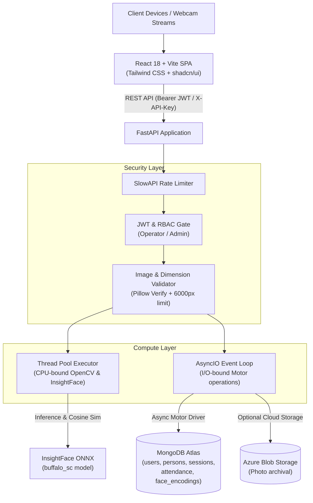

# 🎓 Smart Attend — Enterprise AI Attendance System

[](https://www.python.org/)
[](https://fastapi.tiangolo.com/)
[](https://react.dev/)
[](https://www.typescriptlang.org/)
[](https://www.mongodb.com/)
[](https://github.com/deepinsight/insightface)
[](#testing)
[](#security--remediation-architecture)

> High-throughput, privacy-focused facial recognition attendance system featuring local neural inference with **InsightFace**, async persistence with **MongoDB Atlas (Motor)**, role-based access control with **per-user JWT authentication**, and a modern **React + Vite** dashboard.

---

## 📋 Table of Contents

- [Overview](#overview)
- [System Architecture](#system-architecture)
- [Security & Remediation Architecture (Phase 4)](#security--remediation-architecture-phase-4)
- [Project Directory Structure](#project-directory-structure)
- [Tech Stack](#tech-stack)
- [Prerequisites](#prerequisites)
- [Getting Started](#getting-started)
  - [1. Backend Setup](#1-backend-setup)
  - [2. User Bootstrapping & DB Migration](#2-user-bootstrapping--db-migration)
  - [3. Frontend Setup](#3-frontend-setup)
- [Environment Variables](#environment-variables)
- [API Reference Matrix](#api-reference-matrix)
- [Database Schema & Indexes](#database-schema--indexes)
- [Face Recognition & Quality Pipeline](#face-recognition--quality-pipeline)
- [Testing Suite](#testing-suite)
- [Operations & Scaling Triggers](#operations--scaling-triggers)
- [Deployment Guide](#deployment-guide)
  - [Docker Container](#docker-container)
  - [Render + Vercel Deployment](#render--vercel-deployment)
  - [Azure App Service](#azure-app-service)
- [Troubleshooting & FAQ](#troubleshooting--faq)
- [Disaster Recovery](docs/DISASTER_RECOVERY.md)

---

## Overview

**Smart Attend** eliminates physical punch-cards and manual roll calls with automated, multi-face biometric detection. An operator uploads or streams an image or webcam feed; the neural pipeline detects all faces simultaneously, extracts 512-dimensional facial embeddings, performs cosine similarity matching against enrolled profiles, and marks session attendance idempotently in under a second.

### Highlights
- **Simultaneous Multi-Face Recognition**: Identify and mark entire groups from a single camera frame.
- **Strict Role-Based Access Control**: Granular permissions (Public, Operator, Admin) backed by signed JWT bearer tokens and backward-compatible shared secret fallbacks.
- **Audit Tracking**: Every mutating event records `marked_by` and `enrolled_by` identity stamps.
- **Double-Mark Prevention**: Compound unique indexes enforce strict idempotency per person per session.
- **Transactional Rollback**: Enrollment failures trigger automatic compensating cleanup, preventing orphaned biometric records.
- **Buffer & Dimension Security**: Comprehensive validation preventing decompression bombs and malformed payloads (10 MB max size, 6000×6000 px max dimension).
- **Consolidated Async Architecture**: 100% async database operations using Motor, eliminating event-loop blocking.

---

## System Architecture



---

## Security & Remediation Architecture (Phase 4)

Smart Attend has undergone comprehensive security remediation and architecture modernization across 12 specific dimensions:

| Finding | Severity | Resolution Implemented |
|---|---|---|
| **1. Unprotected `/identify`** | `HIGH` | Gated behind `require_operator` authentication, eliminating open biometric disclosure. |
| **2. Unauthenticated Read Endpoints** | `HIGH` | All read paths authenticated: operational endpoints (`/sessions`, `/attendance`, `/dashboard`) require `operator`; directory details and aggregate analytics (`/persons`, `/reports`) require `admin`. |
| **3. Orphaned Biometric Embeddings** | `HIGH` | Implemented compensating rollback in `routers/persons.py`: if database insertion fails after embedding computation, the face embedding is cleanly rolled back. |
| **4. Broad Exception Swallowing** | `MEDIUM` | Replaced bare `except Exception: pass` in attendance marking with `except DuplicateKeyError: pass`, logging legitimate collisions while letting real DB faults surface. |
| **5. Raw Exception Leaks** | `MEDIUM` | Replaced interpolated exception strings (`f"Error: {e}"`) with sanitized, user-safe error messages while preserving full stack traces in server logs. |
| **6. Image Buffer Exhaustion** | `MEDIUM` | Added post-decode pixel dimension validation (`width <= 6000` and `height <= 6000`) before passing data to computer vision pipelines. |
| **7. Deprecated Naive Datetimes** | `LOW` | Migrated all timestamp call sites from `datetime.utcnow()` to timezone-aware `datetime.now(UTC)`. |
| **8. Dead Azure Training Code** | `LOW` | Removed unused legacy `train_person_group()` no-op from `core/azure_face.py`. |
| **9. `session_id` Type Inconsistency** | `MEDIUM` | Standardized `session_id` as native MongoDB `ObjectId` across storage, indexes, and queries, eliminating `$toString` aggregation overhead. Includes one-time migration utility. |
| **10. Dual Database Clients** | `MEDIUM` | Consolidated all database access onto `Motor` (`AsyncIOMotorClient`), eliminating the secondary synchronous `pymongo.MongoClient`. |
| **11. Shared Secrets to Per-User Identity** | `MEDIUM` | Introduced per-user authentication with salted `scrypt` password hashing, signed JWTs (`/api/auth/login`), audit tracking (`marked_by`, `enrolled_by`), and legacy `X-API-Key` fallback. |
| **12. Embedding Store Scaling** | `MEDIUM` | Formalized explicit performance trigger thresholds (>500 users, p95 latency >2.0s) and multi-tier scaling roadmap in `core/azure_face.py`. |

---

## Project Directory Structure

```
AI-Attendance-System/
├── docs/
│   ├── DISASTER_RECOVERY.md       # Backup verification & collection recovery runbooks
│   └── SECRET_ROTATION.md         # Cryptographic & API key rotation procedures
│
├── .github/workflows/
│   ├── backend-ci.yml             # CI: dependency audit, route verification, pytest
│   └── frontend-ci.yml            # CI: build, typecheck, linting
│
├── backend/
│   ├── main.py                    # Application entrypoint, CORS guard, router registration
│   ├── Dockerfile                 # Production multi-stage Dockerfile (python:3.11-slim)
│   ├── requirements.txt           # Core backend dependencies
│   ├── requirements-dev.txt       # Test harness dependencies
│   ├── pytest.ini                 # Pytest configuration (asyncio mode)
│   ├── .env.example               # Backend configuration template
│   │
│   ├── core/
│   │   ├── auth.py                # JWT creation/verification, scrypt hashing, RBAC dependencies
│   │   ├── azure_face.py          # InsightFace ONNX wrapper, face quality gate, async Motor store
│   │   ├── database.py            # Motor async client, centralized index definitions, queries
│   │   ├── logging_context.py     # Request-ID correlation middleware & logging filter
│   │   ├── rate_limit.py          # SlowAPI rate limiter configuration
│   │   ├── schemas.py             # Pydantic v2 schemas & request/response models
│   │   └── validation.py          # Image byte-size and pixel-dimension validators
│   │
│   ├── routers/
│   │   ├── auth.py                # POST /api/auth/login, POST /register, GET /me
│   │   ├── persons.py             # Person enrollment with rollback, CRUD, debug diagnostics
│   │   ├── sessions.py            # Session lifecycle (create, list, end)
│   │   ├── attendance.py          # Face identification, attendance marking, CSV export
│   │   ├── dashboard.py           # Real-time metrics & recent activity feeds
│   │   └── reports.py             # Daily attendance stats, per-person rates, heatmap matrices
│   │
│   ├── scripts/
│   │   ├── create_user.py         # CLI bootstrap for operator/admin user accounts
│   │   └── migrate_session_id_to_objectid.py # Migration tool for legacy string session IDs
│   │
│   └── tests/
│       ├── conftest.py            # Shared fixtures & test doubles (FakeFace, FakeInsightApp)
│       ├── test_auth_roles.py     # RBAC role separation & legacy header compatibility tests
│       ├── test_user_jwt_auth.py  # JWT issuance, verification, scrypt, and audit recording
│       ├── test_session_id_objectid.py # ObjectId serialization and lookup tests
│       ├── test_single_mongo_client.py # Verification of unified Motor async client
│       ├── test_attendance_idempotency.py # Idempotent attendance mark tests
│       ├── test_duplicate_detection.py # Face duplicate threshold tests
│       ├── test_enrollment_rollback.py # Compensating transaction rollback tests
│       ├── test_face_matching.py  # Cosine similarity and quality filter tests
│       ├── test_validation.py     # Image dimension limits & error sanitization tests
│       ├── test_cors_config.py    # CORS wildcard startup guard tests
│       └── test_cleanup_items.py  # Deprecation fixes & dead code removal tests
│
└── frontend/
    ├── package.json
    ├── vite.config.ts
    ├── tailwind.config.ts
    ├── .env.example
    │
    └── src/
        ├── services/
        │   └── api.ts             # Typed API client with in-memory Bearer token management
        ├── pages/
        │   ├── Index.tsx          # Real-time attendance dashboard & activity timeline
        │   ├── LiveAttendance.tsx # Camera feed / image upload attendance marker
        │   ├── EnrollPerson.tsx   # Multi-image biometric registration form
        │   ├── Records.tsx        # Filterable historical attendance table & CSV download
        │   ├── Reports.tsx        # Trend charts, defaulter breakdown, calendar heatmaps
        │   └── NotFound.tsx       # 404 handler
        ├── components/
        │   ├── AppLayout.tsx      # Application layout shell
        │   ├── AppSidebar.tsx     # Responsive navigation sidebar
        │   ├── MetricCard.tsx     # KPI presentation card
        │   └── ui/                # shadcn/ui components (Radix primitives)
        └── hooks/
            └── use-toast.ts       # Toast notifications hook
```

---

## Tech Stack

| Layer | Technology | Purpose |
|---|---|---|
| **Backend Framework** | [FastAPI](https://fastapi.tiangolo.com/) (0.115+) | High-performance asynchronous REST API |
| **Face Recognition** | [InsightFace](https://github.com/deepinsight/insightface) (`buffalo_sc`) + ONNX Runtime | Local CPU/GPU facial detection and 512-d feature extraction |
| **Image Preprocessing** | OpenCV (`cv2` headless) + Pillow | CLAHE lighting equalization, color mapping, dimension limits |
| **Database** | [MongoDB Atlas](https://www.mongodb.com/atlas) via [Motor](https://motor.readthedocs.io/) | Async document persistence, unique index constraints |
| **Identity & Security** | PyJWT + `hashlib.scrypt` + SlowAPI | Salted credential hashing, JWT tokens, IP rate limiting |
| **Data Validation** | [Pydantic v2](https://docs.pydantic.dev/) | Strict typing, deserialization, and JSON schema generation |
| **Frontend Framework** | [React 18](https://react.dev/) + [Vite 5](https://vitejs.dev/) | Client-side user interface and build tooling |
| **Language** | [TypeScript 5](https://www.typescriptlang.org/) | Type-safe development across UI and API client |
| **Design System** | [Tailwind CSS](https://tailwindcss.com/) + [shadcn/ui](https://ui.shadcn.com/) | Accessible component styling and responsive layouts |
| **State & Data Fetching** | [TanStack Query v5](https://tanstack.com/query) | Async state caching, automated refetching, mutation lifecycle |
| **Charts & Visuals** | [Recharts](https://recharts.org/) | Interactive attendance trends, defaulter bars, heatmaps |

---

## Prerequisites

- **Python**: `3.11` or higher
- **Node.js**: `18.x` or higher (`npm` 9+)
- **MongoDB**: MongoDB Atlas cluster or local instance (v6.0+)
- **Azure Storage** *(optional)*: Azure Storage Account connection string for blob archival
- **Build Tools**: C++ build toolchain (required for compiling InsightFace Cython bindings during initial install; pre-configured inside the Docker image)

---

## Getting Started

### 1. Backend Setup

```bash
# Clone repository
git clone https://github.com/Jashan-randhawa/AI-Attendance-System.git
cd AI-Attendance-System/backend

# Create and activate virtual environment
python -m venv venv
# On Linux/macOS:
source venv/bin/activate
# On Windows:
venv\Scripts\activate

# Install dependencies
pip install -r requirements.txt

# Configure environment variables
cp .env.example .env
# Edit .env with your MongoDB URL, secrets, and allowed origins
```

### 2. User Bootstrapping & DB Migration

Create your initial administrative account using the CLI provisioning tool:

```bash
python scripts/create_user.py --username admin --password "YourSuperSecretPassword123!" --role admin
```

*(Optional)* If you have legacy records created prior to Step 9 where `session_id` was stored as plain text, migrate them to native MongoDB `ObjectId`:

```bash
# Run a dry-run check first
python scripts/migrate_session_id_to_objectid.py --dry-run

# Apply migration
python scripts/migrate_session_id_to_objectid.py

# Verify all records are now native ObjectId
python scripts/migrate_session_id_to_objectid.py --verify
```

Start the backend development server:

```bash
uvicorn main:app --reload --port 8000
```

- **Interactive API Documentation (Swagger)**: [http://localhost:8000/docs](http://localhost:8000/docs)
- **Alternative Documentation (ReDoc)**: [http://localhost:8000/redoc](http://localhost:8000/redoc)

### 3. Frontend Setup

```bash
cd ../frontend

# Configure environment variables
cp .env.example .env
# Set VITE_API_URL=http://localhost:8000

# Install dependencies
npm install

# Start development server
npm run dev
```

The frontend application will be running at [http://localhost:5173](http://localhost:5173).

---

## Environment Variables

### Backend Configuration (`backend/.env`)

```ini
# ── Identity & Access Security ───────────────────────────────────────────────
# Secret key used for signing JWT access tokens (Minimum 32 random characters in production)
JWT_SECRET=your-secure-random-jwt-secret-string-min-32-chars
JWT_EXPIRY_HOURS=12

# Shared-secret API keys (Optional fallback; supports comma-separated rotation lists)
API_KEY_ADMIN=admin-secret-key-1
API_KEY_OPERATOR=operator-secret-key-1
API_KEY=legacy-admin-key

# ── MongoDB Atlas ─────────────────────────────────────────────────────────────
MONGODB_URL=mongodb+srv://<username>:<password>@cluster0.xxxxx.mongodb.net/?retryWrites=true&w=majority
MONGODB_DB_NAME=attendance_db

# ── Azure Blob Storage (Optional archival) ────────────────────────────────────
AZURE_STORAGE_CONNECTION_STRING=DefaultEndpointsProtocol=https;AccountName=...
AZURE_BLOB_CONTAINER=attendance-photos

# ── Face Recognition Thresholds ──────────────────────────────────────────────
MIN_CONFIDENCE=0.40          # Range 0.10 - 1.00 (Raise to 0.60+ for high-security environments)
DUPLICATE_THRESHOLD=0.45     # Range 0.10 - 1.00 (Must be >= MIN_CONFIDENCE)

# ── CORS & Network Security ──────────────────────────────────────────────────
# Comma-separated list of allowed origins. Wildcards (*) are rejected at startup.
ALLOWED_ORIGINS=http://localhost:5173,https://your-frontend.vercel.app
```

### Frontend Configuration (`frontend/.env`)

```ini
VITE_API_URL=http://localhost:8000
# Optional legacy fallback key if not authenticating via username/password:
VITE_API_KEY=
```

---

## API Reference Matrix

All protected endpoints accept either `Authorization: Bearer <JWT>` or `X-API-Key: <key>`. Admin credentials satisfy both operator and admin permissions.

### 🔑 Authentication (`/api/auth`)

| Method | Endpoint | Required Role | Rate Limit | Description |
|---|---|---|---|---|
| `POST` | `/api/auth/login` | **Public** | - | Verify credentials and receive a signed JWT token. |
| `POST` | `/api/auth/register` | **Admin** | - | Provision a new operator or admin user. |
| `GET` | `/api/auth/me` | **Operator** | - | Retrieve profile details of the authenticated identity. |

### 👤 Persons & Biometrics (`/api/persons`)

| Method | Endpoint | Required Role | Rate Limit | Description |
|---|---|---|---|---|
| `GET` | `/api/persons` | **Admin** | - | List all active enrolled persons with metadata. |
| `GET` | `/api/persons/{id}` | **Admin** | - | Fetch detailed profile for a specific person. |
| `POST` | `/api/persons/enroll` | **Admin** | `10/min` | Multi-image enrollment with automatic quality filters and compensating rollback. |
| `DELETE`| `/api/persons/{id}` | **Admin** | - | Soft-delete a person, preserving historic attendance records. |
| `GET` | `/api/persons/debug-encodings` | **Admin** | - | Diagnostic report listing persons missing biometric vectors. |

### 📅 Sessions (`/api/sessions`)

| Method | Endpoint | Required Role | Rate Limit | Description |
|---|---|---|---|---|
| `GET` | `/api/sessions` | **Operator** | - | Query sessions with optional `?active=true` filter. |
| `GET` | `/api/sessions/{id}` | **Operator** | - | Fetch single session metadata by ObjectId. |
| `POST` | `/api/sessions` | **Operator** | - | Create a new attendance session. |
| `PATCH`| `/api/sessions/{id}/end` | **Operator** | - | Terminate an active session and timestamp its conclusion. |

### 📸 Attendance Operations (`/api/attendance`)

| Method | Endpoint | Required Role | Rate Limit | Description |
|---|---|---|---|---|
| `POST` | `/api/attendance/identify` | **Operator** | `20/min` | Identify faces in a frame without recording attendance. |
| `POST` | `/api/attendance/mark/{session_id}` | **Operator** | `20/min` | Identify all faces and insert idempotent attendance records. |
| `GET` | `/api/attendance` | **Operator** | - | List records filtered by `session_id`, `person_id`, or `date`. |
| `GET` | `/api/attendance/export/csv` | **Admin** | - | Export attendance records to a downloadable CSV stream. |

### 📊 Dashboard & Reports

| Method | Endpoint | Required Role | Description |
|---|---|---|---|
| `GET` | `/api/dashboard/metrics` | **Operator** | Total enrolled, active sessions, attendance rates today. |
| `GET` | `/api/dashboard/activity` | **Operator** | Feed of the 8 most recent attendance events. |
| `GET` | `/api/reports/daily` | **Admin** | Day-by-day attendance trends over `?days=N` (default: 30). |
| `GET` | `/api/reports/persons` | **Admin** | Per-person attendance metrics and defaulter flags (<75%). |
| `GET` | `/api/reports/heatmap` | **Admin** | Matrix of individual presence over `?days=N` (default: 14). |

---

## Database Schema & Indexes

### Collection Schemas

#### 1. `users`
```json
{
  "_id": "ObjectId",
  "username": "jashan_admin",
  "password_hash": "scrypt$16384$8$1$salt$derived_key",
  "role": "admin",
  "is_active": true,
  "created_at": "2026-09-12T13:00:00Z"
}
```

#### 2. `persons`
```json
{
  "_id": "c7f99147-36e6-42d1-9430-c3d3957bf9e1",
  "name": "Jashan Randhawa",
  "email": "jashan@example.com",
  "department": "Engineering",
  "photo_url": "https://storage.blob.core.windows.net/photos/...",
  "enrolled_at": "2026-09-12T13:05:00Z",
  "enrolled_by": "66e2c...",
  "is_active": true
}
```

#### 3. `face_encodings`
```json
{
  "_id": "c7f99147-36e6-42d1-9430-c3d3957bf9e1",
  "name": "Jashan Randhawa",
  "embeddings": [
    [0.0421, -0.0125, 0.0894, "... 512 float values ..."]
  ]
}
```

#### 4. `sessions`
```json
{
  "_id": "ObjectId('66e2d1487f98...')",
  "label": "Engineering All-Hands — Week 37",
  "department": "Engineering",
  "started_at": "2026-09-12T14:00:00Z",
  "ended_at": null,
  "is_active": true
}
```

#### 5. `attendance`
```json
{
  "_id": "ObjectId('66e2d1998a12...')",
  "person_id": "c7f99147-36e6-42d1-9430-c3d3957bf9e1",
  "session_id": "ObjectId('66e2d1487f98...')",
  "marked_at": "2026-09-12T14:02:18Z",
  "confidence": 0.8942,
  "status": "present",
  "marked_by": "66e2c..."
}
```

### Database Indexes

- **`users`**: Unique index on `username`.
- **`persons`**: Ascending index on `name`, `is_active`. Case-insensitive unique partial index on `name` where `is_active: true`.
- **`sessions`**: Index on `is_active` and `started_at` descending.
- **`attendance`**: **Compound unique index** on `(person_id, session_id)` (guarantees idempotency); indexes on `marked_at` descending and `status`.
- **`face_encodings`**: Index on `name`.

---

## Face Recognition & Quality Pipeline

```
[Raw Photo Upload] ──> [Format & Pillow Byte Validation]
                             │
                             ▼
              [Pixel Dimension Check (<= 6000x6000px)]
                             │
                             ▼
              [CLAHE Preprocessing (LAB Color Equalization)]
                             │
                             ▼
              [InsightFace Detection (det_thresh >= 0.30)]
                             │
                             ▼
              [Face Quality Acceptance Gate]
                 ├── Detection confidence >= 0.60
                 ├── Bounding box >= 60x60 pixels
                 ├── Center margin clearance >= 5% from edges
                 └── Keypoint eye distance >= 20% width (Pose Angle)
                             │
                             ▼
              [Duplicate Face Similarity Gate]
                 └── Cosine Similarity < DUPLICATE_THRESHOLD (0.45)
                             │
                             ▼
              [512-d Feature Extraction & Storage]
```

---

## Testing Suite

The repository contains an exhaustive test suite of **63 unit and integration tests** verifying security policies, error responses, database idempotency, image safety, and facial comparison math. Tests run without requiring an active database or GPU by utilizing deterministic in-memory fixtures.

```bash
cd backend

# Run the complete test suite
pytest -v

# Run specific domain test suites
pytest tests/test_user_jwt_auth.py          # JWT, passwords, RBAC
pytest tests/test_session_id_objectid.py    # ObjectId standardization & lookups
pytest tests/test_single_mongo_client.py    # Motor consolidation checks
pytest tests/test_attendance_idempotency.py # Double-mark prevention
pytest tests/test_enrollment_rollback.py    # Compensating transactions
pytest tests/test_validation.py             # Buffer & pixel limit checks
```

```text
============================== test session starts ==============================
collected 63 items

tests/test_attendance_idempotency.py .....                                [  7%]
tests/test_auth_roles.py ..............                                   [ 30%]
tests/test_cleanup_items.py ....                                          [ 36%]
tests/test_cors_config.py ....                                            [ 42%]
tests/test_duplicate_detection.py .....                                   [ 50%]
tests/test_enrollment_rollback.py ...                                     [ 55%]
tests/test_face_matching.py .............                                 [ 76%]
tests/test_session_id_objectid.py ..                                      [ 79%]
tests/test_single_mongo_client.py ...                                     [ 84%]
tests/test_user_jwt_auth.py ......                                        [ 93%]
tests/test_validation.py ....                                             [100%]

============================== 63 passed in 2.39s ===============================
```

---

## Operations & Scaling Triggers

Biometric embeddings are currently compared using in-memory vectorized cosine similarity. To balance operational simplicity with scalability, the following trigger thresholds are monitored via structured performance logs (`metrics_logger`):

- **Trigger Threshold 1**: Active enrolled count exceeds **500 persons**.
- **Trigger Threshold 2**: Observed 95th-percentile (`p95`) identification latency exceeds **2.0 seconds**.

### Scaling Escalation Roadmap
1. **Tier 1 (In-Process Cache)**: Cache the normalized embedding matrix in-process as a contiguous NumPy array, invalidated upon enroll/delete events.
2. **Tier 2 (Vector Search Index)**: Migrate matching logic to **MongoDB Atlas Vector Search** (HNSW index) or dedicated vector store (FAISS).

---

## Deployment Guide

### Docker Container

The backend includes a production-ready `Dockerfile` that pre-compiles native extensions and downloads the InsightFace weights at build time for instant cold starts:

```bash
# Build the Docker image
docker build -t smart-attend-backend ./backend

# Run the container
docker run -d \
  --name smart-attend \
  -p 8000:8000 \
  --env-file ./backend/.env \
  smart-attend-backend
```

### Render + Vercel Deployment

1. **Backend on Render (Web Service)**:
   - Environment: `Docker` (points to `backend/Dockerfile`).
   - Add environment variables in the Render Dashboard.
   - Set Health Check Path: `/health`.

2. **Frontend on Vercel**:
   - Set Root Directory to `frontend`.
   - Build Command: `npm run build`.
   - Output Directory: `dist`.
   - Set `VITE_API_URL` to your Render backend URL.

### Azure App Service

```bash
# Push container to Azure Container Registry
az acr build --registry <acr-name> --image smart-attend:latest ./backend

# Create web app running the container
az webapp create \
  --resource-group <resource-group> \
  --plan <app-service-plan> \
  --name smart-attend-backend \
  --deployment-container-image-name <acr-name>.azurecr.io/smart-attend:latest
```

---

## Troubleshooting & FAQ

#### `401 Unauthorized: Missing or invalid API key or Bearer token`
Ensure your request header carries `Authorization: Bearer <your_jwt_token>` or `X-API-Key: <your_key>`. For read endpoints, verify that your user account has at least the `operator` role (or `admin` for `/reports` and `/persons`).

#### `400 Bad Request: Image dimensions exceed the maximum allowed (6000x6000)`
The uploaded frame or photo exceeds pixel boundaries designed to prevent memory decompression denial-of-service. Resize or downscale images before submitting.

#### `409 Conflict: This face is already enrolled`
The duplicate check detected that the uploaded face is already associated with an existing enrolled profile (cosine similarity exceeded `DUPLICATE_THRESHOLD`). Delete the existing person record first if re-enrollment is necessary.

#### `503 Service Unavailable: Server misconfiguration`
Occurs if no admin API key and no JWT secrets are defined in the environment. Set `JWT_SECRET` and `API_KEY_ADMIN` in `.env`.

---

## License

This project is licensed under the MIT License. Developed for automated attendance tracking and portfolio demonstrations.
