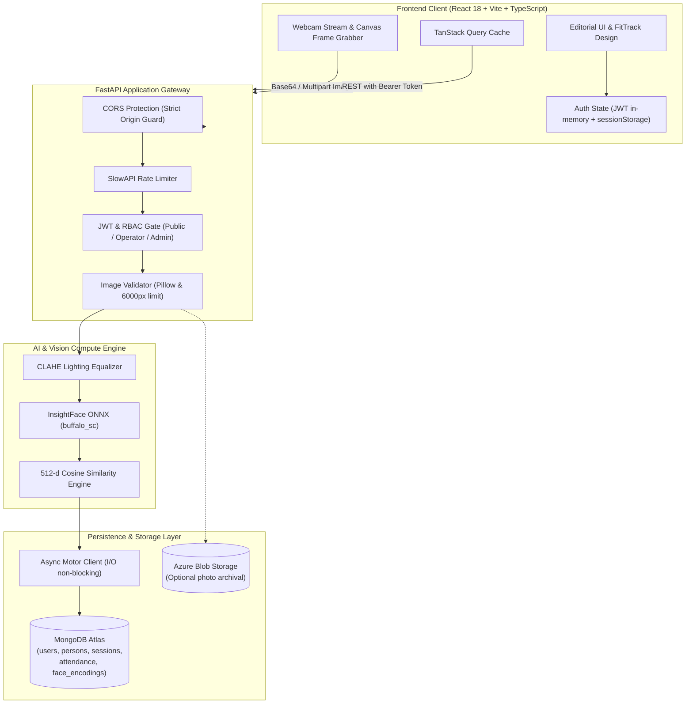
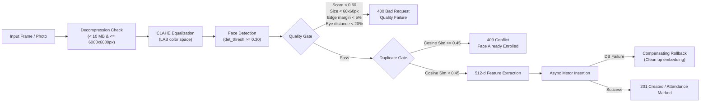

# 🎓 SmartAttend — Enterprise AI Biometric Attendance & Surveillance System

[](https://www.python.org/)
[](https://fastapi.tiangolo.com/)
[](https://react.dev/)
[](https://www.typescriptlang.org/)
[](https://vitejs.dev/)
[](https://tailwindcss.com/)
[](https://www.mongodb.com/)
[](https://github.com/deepinsight/insightface)
[](#testing-suite)
[](#testing-suite)
[](LICENSE)

> High-throughput, privacy-focused facial recognition attendance and surveillance system featuring real-time neural inference with **InsightFace ONNX**, async persistence with **MongoDB Atlas (Motor)**, strict role-based access control (**per-user JWT + salted scrypt**), and an editorial, Apple-grade **React 18 + Vite** client inspired by the **FitTrack** design system.

---

## ⚡ Quick Demo Access

The development server is pre-configured with quick-login accounts for immediate testing:

| Role | Username | Password | Privileges |
|---|---|---|---|
| **Administrator** | `admin` | `admin123` | Full access: Biometric enrollment, people directory, analytics, defaulter audits, user accounts, system diagnostics & CSV exports. |
| **Operator** | `operator` | `operator123` | Operational access: Live camera surveillance, instant attendance scanning, session lifecycle management, and record lookups. |

*Quick presets can also be populated with 1 click directly on the login screen.*

---

## 📋 Table of Contents

- [Overview & Key Capabilities](#overview--key-capabilities)
- [System Architecture](#system-architecture)
- [Project Directory Structure](#project-directory-structure)
- [Tech Stack Matrix](#tech-stack-matrix)
- [Getting Started & Local Setup](#getting-started--local-setup)
  - [1. Backend Setup](#1-backend-setup)
  - [2. User Bootstrapping & CLI Tooling](#2-user-bootstrapping--cli-tooling)
  - [3. Frontend Setup](#3-frontend-setup)
- [Environment Configuration](#environment-configuration)
- [Complete REST API Matrix](#complete-rest-api-matrix)
- [Biometric Inference & Quality Pipeline](#biometric-inference--quality-pipeline)
- [Database Schema & Constraints](#database-schema--constraints)
- [Frontend UX & Design System](#frontend-ux--design-system)
- [Testing Suite](#testing-suite)
- [Production Deployment](#production-deployment)
  - [Docker Container](#docker-container)
  - [Render + Vercel](#render--vercel)
  - [Azure App Service](#azure-app-service)
- [Security & Disaster Recovery](#security--disaster-recovery)
- [Troubleshooting & FAQ](#troubleshooting--faq)
- [License](#license)

---

## Overview & Key Capabilities

**SmartAttend** eliminates traditional punch-cards, proximity cards, and manual roll-calls with high-precision, multi-subject biometric detection. Operators launch an attendance session from any browser or live camera stream; the neural pipeline processes frames in real-time, isolates facial regions, computes 512-dimensional embeddings via local ONNX inference, and records session attendance idempotently in **under 500ms**.

### 🌟 Highlights

- **Simultaneous Multi-Face Recognition**: Mark entire classrooms or meeting halls in a single webcam frame.
- **Enterprise RBAC Security**: Stateless per-user JWTs signed with HMAC-SHA256, salted `scrypt` credential hashing, and legacy `X-API-Key` rotation fallbacks.
- **Biometric Quality Acceptance Gate**: Rejects blurry, off-angle, or low-contrast photos before vector indexing (checks pose angle, bounding box size, edge margin, and detection confidence).
- **Compensating Rollback Architecture**: Prevents orphaned biometric vectors by automatically undoing face embeddings if metadata persistence fails during enrollment.
- **Idempotent Double-Mark Prevention**: Compound unique indexes `(person_id, session_id)` in MongoDB ensure a person cannot be double-counted in the same session.
- **FitTrack-Inspired Editorial Design**: Editorial typography (`Playfair Display` + `Inter`), organic 60-30-10 color combination (Warm Parchment, Deep Ink, Emerald Accent, Golden Hour), Apple-grade layered elevations, and native Dark/Light mode.
- **Collapsible Rail Navigation**: Compact 68px icon rail expanding smoothly on hover to 280px with a 160ms anti-flicker debounce, pin toggle, and zero layout shift.
- **Deep Analytics & Heatmaps**: 7/30/90-day attendance trend lines, present vs. late headcount distributions, 14-day individual presence heatmap matrices, and automatic defaulter flagging (<75%).

---

## System Architecture

### End-to-End Dataflow



### Biometric Verification & Quality Pipeline



---

## Project Directory Structure

```
AI-Attendance-System/
├── docs/
│   ├── DISASTER_RECOVERY.md       # MongoDB backup, restore & index recovery runbooks
│   └── SECRET_ROTATION.md         # JWT secret & API key rotation procedures
│
├── .github/workflows/
│   ├── backend-ci.yml             # Pytest test suite, dependency scan, route validation
│   └── frontend-ci.yml            # Vite build, TypeScript typecheck, Vitest tests
│
├── backend/
│   ├── Dockerfile                 # Production multi-stage Docker container (Python 3.11-slim)
│   ├── main.py                    # FastAPI entrypoint, CORS configuration & router registration
│   ├── requirements.txt           # Core backend dependencies (FastAPI, Motor, InsightFace, OpenCV)
│   ├── requirements-dev.txt       # Testing & linting tools (pytest, httpx, pytest-asyncio)
│   ├── pytest.ini                 # Pytest configuration
│   ├── .env.example               # Backend environment variable template
│   │
│   ├── core/
│   │   ├── auth.py                # JWT creation/verification, scrypt hashing, RBAC dependencies
│   │   ├── azure_face.py          # InsightFace ONNX wrapper, face quality gates & Motor store
│   │   ├── database.py            # Unified Motor async client, compound indexes & queries
│   │   ├── logging_context.py     # Request-ID correlation middleware & structured logging
│   │   ├── rate_limit.py          # SlowAPI rate limiter definitions
│   │   ├── schemas.py             # Pydantic v2 request/response validation models
│   │   └── validation.py          # Buffer size and pixel dimension safety limits
│   │
│   ├── routers/
│   │   ├── auth.py                # POST /api/auth/login, POST /register, GET /me
│   │   ├── persons.py             # Biometric enrollment with rollback, CRUD, /analyze endpoint
│   │   ├── sessions.py            # Session creation, listing, termination
│   │   ├── attendance.py          # Multi-face identification, idempotent marking, CSV export
│   │   ├── dashboard.py           # Real-time metrics & recent activity feeds
│   │   └── reports.py             # Daily trends, per-person stats, 14-day heatmap matrices
│   │
│   ├── scripts/
│   │   ├── create_user.py         # CLI bootstrap for operator/admin user credentials
│   │   └── migrate_session_id_to_objectid.py # Migration utility for legacy string session IDs
│   │
│   └── tests/                     # 63 passing unit and integration tests
│       ├── conftest.py            # Shared fixtures & deterministic test doubles
│       ├── test_auth_roles.py     # RBAC role separation & legacy header fallback tests
│       ├── test_user_jwt_auth.py  # JWT lifecycle, scrypt verification, audit fields
│       ├── test_session_id_objectid.py # ObjectId serialization & lookup tests
│       ├── test_single_mongo_client.py # Unified Motor client verification
│       ├── test_attendance_idempotency.py # Compound unique index double-mark tests
│       ├── test_duplicate_detection.py # Cosine duplicate rejection tests
│       ├── test_enrollment_rollback.py # Compensating transaction rollback tests
│       ├── test_face_matching.py  # Cosine similarity and quality filter tests
│       ├── test_validation.py     # Image dimension limits & error sanitization tests
│       ├── test_cors_config.py    # CORS wildcard startup guard tests
│       └── test_cleanup_items.py  # Deprecation fixes & dead code removal tests
│
└── frontend/
    ├── package.json               # Frontend dependencies (React 18, Vite 5, Tailwind, Recharts)
    ├── vite.config.ts             # Vite build configuration, path aliases & vendor chunk splitting
    ├── tailwind.config.ts         # Design tokens, fonts, layered shadows & animations
    ├── .env.example               # Frontend environment template
    │
    └── src/
        ├── auth/
        │   ├── AuthContext.tsx    # Global auth profile, token lifecycle & role state
        │   ├── ProtectedRoute.tsx # Route gate redirecting unauthenticated users to /login
        │   └── RoleGuard.tsx      # Admin-only privilege gate with fallbacks
        │
        ├── theme/
        │   └── ThemeContext.tsx   # Light/Dark mode state management & localStorage sync
        │
        ├── services/
        │   └── api.ts             # Typed Axios client with Bearer auth & ApiError handling
        │
        ├── hooks/
        │   ├── useAttendanceQueries.ts # TanStack Query v5 hooks with cache invalidation
        │   └── use-toast.ts       # Toast notification hook
        │
        ├── components/
        │   ├── AppLayout.tsx      # Centered layout container with generous vertical margins
        │   ├── AppSidebar.tsx     # FitTrack-style collapsible sidebar (68px rail, hover expand, pin)
        │   ├── PageHeader.tsx     # Standardized header with serif title, badge & partition divider
        │   ├── ThemeToggle.tsx    # Sun/Moon toggle (switch and icon variants)
        │   ├── MetricCard.tsx     # Apple-grade KPI card with hairline light bevels
        │   └── ui/                # Accessible shadcn/ui components (Radix primitives)
        │
        └── pages/
            ├── Index.tsx          # Real-time dashboard with Recharts trend chart & live feed
            ├── LiveAttendance.tsx # Camera stream with bounding boxes, sound alerts & auto-scan
            ├── Sessions.tsx       # Active sessions callout, creation modal & past sessions
            ├── People.tsx         # People directory with department filters & admin deletion
            ├── PersonDetails.tsx  # 90-day stats, defaulter alert (<75%) & attendance history
            ├── EnrollPerson.tsx   # Live webcam capture, quality analysis & biometric enrollment
            ├── Records.tsx        # Multi-filter records table with Admin CSV download
            ├── Reports.tsx        # Daily trends, present/late bars, 14-day heatmap, defaulters
            ├── UserManagement.tsx # Admin user account provisioning & role assignment
            ├── SystemHealth.tsx   # Service diagnostics, threshold settings & vector audit
            ├── Login.tsx          # FitTrack split-panel editorial authentication page
            └── NotFound.tsx       # 404 handler
```

---

## Tech Stack Matrix

| Domain | Technology | Version | Purpose |
|---|---|---|---|
| **Backend API** | [FastAPI](https://fastapi.tiangolo.com/) | `0.115+` | Asynchronous REST API framework |
| **Computer Vision** | [InsightFace](https://github.com/deepinsight/insightface) (`buffalo_sc`) | `0.7.3` | Facial detection, alignment & 512-d embeddings |
| **Runtime Inference** | [ONNX Runtime](https://onnxruntime.ai/) | `1.19+` | High-performance CPU/GPU neural model execution |
| **Image Preprocessing** | [OpenCV](https://opencv.org/) + [Pillow](https://python-pillow.org/) | `4.10+` | CLAHE histogram equalization, format decoding, bounds safety |
| **Database** | [MongoDB Atlas](https://www.mongodb.com/) via [Motor](https://motor.readthedocs.io/) | `3.6+` | Non-blocking async document store with unique constraints |
| **Security & Auth** | PyJWT + `hashlib.scrypt` + SlowAPI | `2.9+` | Per-user signed JWTs, salted password hashing, IP rate limiting |
| **Data Validation** | [Pydantic v2](https://docs.pydantic.dev/) | `2.9+` | Schema validation, type safety, JSON serialization |
| **Frontend Framework** | [React 18](https://react.dev/) + [Vite 5](https://vitejs.dev/) | `18.3` / `5.4` | Modern SPA with fast HMR and optimized chunk bundling |
| **Language** | [TypeScript](https://www.typescriptlang.org/) | `5.5+` | End-to-end static type safety |
| **Styling & Design** | [Tailwind CSS](https://tailwindcss.com/) + [shadcn/ui](https://ui.shadcn.com/) | `3.4+` | FitTrack editorial typography, Apple-grade elevations, Radix UI |
| **State & Cache** | [TanStack Query v5](https://tanstack.com/query) | `5.56+` | Server state caching, optimistic updates, automatic refetching |
| **Motion & Animations**| [GSAP](https://greensock.com/gsap/) + `@gsap/react` | `3.12+` | Micro-interactions, timeline entrances, smooth state transitions |
| **Data Visuals** | [Recharts](https://recharts.org/) | `2.12+` | Area trend charts, headcount bars, attendance matrices |

---

## Getting Started & Local Setup

### Prerequisites

- **Python**: `3.11` or higher
- **Node.js**: `18.x` or higher (`npm` 9+)
- **MongoDB**: MongoDB Atlas cluster or local instance (v6.0+)
- **C++ Compiler**: Microsoft Visual C++ Build Tools (Windows) or `build-essential` (Linux) for InsightFace Cython bindings

---

### 1. Backend Setup

```bash
# Clone repository
git clone https://github.com/Jashan-randhawa/AI-Attendance-System.git
cd AI-Attendance-System/backend

# Create and activate virtual environment
python -m venv venv
# On Windows (PowerShell):
venv\Scripts\Activate.ps1
# On Linux/macOS:
source venv/bin/activate

# Install dependencies
pip install -r requirements.txt

# Configure environment variables
cp .env.example .env
# Edit .env with your MongoDB URL and JWT secret
```

---

### 2. User Bootstrapping & CLI Tooling

Create administrative and operator accounts using the built-in CLI bootstrapping utility:

```bash
# Create initial Administrator account
python scripts/create_user.py --username admin --password "admin123" --role admin

# Create an Operator account
python scripts/create_user.py --username operator --password "operator123" --role operator
```

*(Optional)* If you have legacy records where `session_id` was stored as plain text, migrate them to native MongoDB `ObjectId`:

```bash
# Perform dry-run audit
python scripts/migrate_session_id_to_objectid.py --dry-run

# Apply migration and verify
python scripts/migrate_session_id_to_objectid.py
python scripts/migrate_session_id_to_objectid.py --verify
```

Start the backend API server:

```bash
uvicorn main:app --reload --port 8000
```

- **Interactive API Documentation (Swagger)**: [http://localhost:8000/docs](http://localhost:8000/docs)
- **Alternative Documentation (ReDoc)**: [http://localhost:8000/redoc](http://localhost:8000/redoc)

---

### 3. Frontend Setup

In a new terminal window:

```bash
cd AI-Attendance-System/frontend

# Configure environment variables
cp .env.example .env
# Ensure VITE_API_URL=http://localhost:8000

# Install dependencies
npm install

# Run frontend development server
npm run dev
```

Open [http://localhost:5173](http://localhost:5173) in your browser. Use the quick-preset buttons on the login screen to sign in as **Admin** or **Operator**.

---

## Environment Configuration

### Backend Configuration (`backend/.env`)

```ini
# ── Identity & Access Security ───────────────────────────────────────────────
# Secret key used for signing JWT access tokens (Minimum 32 random characters in production)
JWT_SECRET=your-secure-random-jwt-secret-string-min-32-chars
JWT_EXPIRY_HOURS=12

# Shared-secret API keys (Optional fallback; supports comma-separated rotation lists)
API_KEY_ADMIN=admin-secret-key-1
API_KEY_OPERATOR=operator-secret-key-1
API_KEY=legacy-admin-key

# ── MongoDB Atlas ─────────────────────────────────────────────────────────────
MONGODB_URL=mongodb+srv://<username>:<password>@cluster0.xxxxx.mongodb.net/?retryWrites=true&w=majority
MONGODB_DB_NAME=attendance_db

# ── Azure Blob Storage (Optional archival) ────────────────────────────────────
AZURE_STORAGE_CONNECTION_STRING=DefaultEndpointsProtocol=https;AccountName=...
AZURE_BLOB_CONTAINER=attendance-photos

# ── Face Recognition Thresholds ──────────────────────────────────────────────
MIN_CONFIDENCE=0.40          # Range 0.10 - 1.00 (Raise to 0.60+ for high-security environments)
DUPLICATE_THRESHOLD=0.45     # Range 0.10 - 1.00 (Must be >= MIN_CONFIDENCE)

# ── CORS & Network Security ──────────────────────────────────────────────────
# Comma-separated list of allowed origins. Wildcards (*) are rejected at startup.
ALLOWED_ORIGINS=http://localhost:5173,https://your-frontend.vercel.app
```

### Frontend Configuration (`frontend/.env`)

```ini
VITE_API_URL=http://localhost:8000
# Optional legacy API key fallback:
VITE_API_KEY=
```

---

## Complete REST API Matrix

All protected endpoints accept either `Authorization: Bearer <JWT>` or `X-API-Key: <key>`. Admin credentials satisfy both operator and admin privileges.

### 🔑 Authentication (`/api/auth`)

| Method | Endpoint | Required Role | Rate Limit | Description |
|---|---|---|---|---|
| `POST` | `/api/auth/token` | **Public** | - | Verify credentials and return signed JWT token. |
| `POST` | `/api/auth/register` | **Admin** | - | Provision a new operator or admin account. |
| `GET` | `/api/auth/me` | **Operator** | - | Retrieve authenticated user profile and role. |
| `GET` | `/api/auth/users` | **Admin** | - | List all user accounts in the system. |

### 👤 Persons & Biometrics (`/api/persons`)

| Method | Endpoint | Required Role | Rate Limit | Description |
|---|---|---|---|---|
| `GET` | `/api/persons` | **Admin** | - | List all active enrolled persons with department and photo info. |
| `GET` | `/api/persons/{id}` | **Admin** | - | Fetch detailed profile and 90-day attendance metrics for a person. |
| `POST` | `/api/persons/enroll` | **Admin** | `10/min` | Multi-image enrollment with automatic quality gates and compensating rollback. |
| `POST` | `/api/persons/enroll/analyze`| **Admin** | `20/min` | Pre-enrollment quality diagnostic on raw photo (quality score, blur, pose). |
| `DELETE`| `/api/persons/{id}` | **Admin** | - | Soft-delete a person, preserving historic attendance integrity. |
| `GET` | `/api/persons/debug-encodings`| **Admin** | - | Diagnostic audit listing persons missing biometric vectors. |

### 📅 Sessions (`/api/sessions`)

| Method | Endpoint | Required Role | Rate Limit | Description |
|---|---|---|---|---|
| `GET` | `/api/sessions` | **Operator** | - | Query sessions with optional `?active=true` filter. |
| `GET` | `/api/sessions/{id}` | **Operator** | - | Fetch single session metadata by native ObjectId. |
| `POST` | `/api/sessions` | **Operator** | - | Create a new attendance session. |
| `PATCH`| `/api/sessions/{id}/end` | **Operator** | - | Conclude an active session and record completion timestamp. |

### 📸 Attendance Operations (`/api/attendance`)

| Method | Endpoint | Required Role | Rate Limit | Description |
|---|---|---|---|---|
| `POST` | `/api/attendance/identify` | **Operator** | `20/min` | Identify faces in a frame with bounding boxes without marking attendance. |
| `POST` | `/api/attendance/mark/{session_id}` | **Operator** | `20/min` | Identify all faces and insert idempotent attendance records. |
| `GET` | `/api/attendance` | **Operator** | - | Query records filtered by `session_id`, `person_id`, `department`, or `date`. |
| `GET` | `/api/attendance/export/csv` | **Admin** | - | Stream attendance records formatted as a downloadable CSV. |

### 📊 Dashboard & Analytics (`/api/dashboard`, `/api/reports`)

| Method | Endpoint | Required Role | Description |
|---|---|---|---|
| `GET` | `/api/dashboard/metrics` | **Operator** | Summary KPIs: total enrolled, active sessions, today's attendance rate. |
| `GET` | `/api/dashboard/recent-activity` | **Operator** | Real-time feed of the 8 most recent scan events. |
| `GET` | `/api/reports/daily` | **Admin** | Day-by-day attendance trends over `?days=N` (default: 30). |
| `GET` | `/api/reports/persons` | **Admin** | Per-person attendance rates and defaulter flags (<75%). |
| `GET` | `/api/reports/heatmap` | **Admin** | 14-day individual presence matrix for visual heatmaps. |

---

## Biometric Inference & Quality Pipeline

To ensure reliable identification across variable lighting conditions, camera hardware, and angles, SmartAttend implements a multi-stage computer vision pipeline:

1. **Format & Safety Decoders**:
   - Validates MIME type and decodes image bytes via Pillow.
   - Enforces a hard pixel boundary: **Width <= 6000px and Height <= 6000px** and **Payload <= 10 MB** to neutralize decompression bomb vectors.
2. **CLAHE Lighting Preprocessing**:
   - Converts the frame to the **LAB color space** and applies Contrast Limited Adaptive Histogram Equalization to the `L` luminance channel, preventing harsh shadows or overexposure from degrading accuracy.
3. **InsightFace ONNX Detection**:
   - Runs `buffalo_sc` neural model with a detection confidence threshold >= `0.30`.
4. **Quality Acceptance Gate**:
   - **Detection Confidence**: Must be >= `0.60`.
   - **Bounding Box Size**: Face rectangle must be >= `60x60` pixels.
   - **Edge Margins**: Face center must be at least `5%` inside the frame boundaries.
   - **Pose & Alignment**: Landmark eye distance must be >= `20%` of face width, filtering out extreme profiles.
5. **Duplicate Collision Gate**:
   - Compares the candidate embedding against all enrolled vectors via cosine similarity. If similarity >= `DUPLICATE_THRESHOLD` (`0.45`), enrollment is rejected with `409 Conflict`.
6. **Compensating Rollback**:
   - If any database error occurs after vector extraction, the system automatically triggers a rollback deleting any partial vectors, preventing ghost enrollments.

---

## Database Schema & Constraints

### Collection Models

#### 1. `users`
```json
{
  "_id": "ObjectId",
  "username": "admin",
  "password_hash": "scrypt$16384$8$1$salt$derived_key",
  "role": "admin",
  "is_active": true,
  "created_at": "2026-09-12T13:00:00Z"
}
```

#### 2. `persons`
```json
{
  "_id": "c7f99147-36e6-42d1-9430-c3d3957bf9e1",
  "name": "Jashan Randhawa",
  "email": "jashan@example.com",
  "department": "Engineering",
  "photo_url": "https://storage.blob.core.windows.net/photos/...",
  "enrolled_at": "2026-09-12T13:05:00Z",
  "enrolled_by": "66e2c...",
  "is_active": true
}
```

#### 3. `face_encodings`
```json
{
  "_id": "c7f99147-36e6-42d1-9430-c3d3957bf9e1",
  "name": "Jashan Randhawa",
  "embeddings": [
    [0.0421, -0.0125, 0.0894, "... 512 normalized float values ..."]
  ]
}
```

#### 4. `sessions`
```json
{
  "_id": "ObjectId('66e2d1487f98...')",
  "label": "Engineering All-Hands — Week 37",
  "department": "Engineering",
  "started_at": "2026-09-12T14:00:00Z",
  "ended_at": null,
  "is_active": true
}
```

#### 5. `attendance`
```json
{
  "_id": "ObjectId('66e2d1998a12...')",
  "person_id": "c7f99147-36e6-42d1-9430-c3d3957bf9e1",
  "session_id": "ObjectId('66e2d1487f98...')",
  "marked_at": "2026-09-12T14:02:18Z",
  "confidence": 0.8942,
  "status": "present",
  "marked_by": "66e2c..."
}
```

### Strategic Compound Indexes

- **`attendance`**: Compound unique index on `(person_id, session_id)`. Enforces strict idempotency at the database engine level; duplicate scans gracefully return the existing attendance confirmation without error.
- **`attendance`**: Indexes on `marked_at` (descending) and `status` for fast date-range filtering.
- **`persons`**: Case-insensitive unique partial index on `name` where `is_active: true`.
- **`users`**: Unique index on `username`.
- **`sessions`**: Compound index on `(is_active, started_at)`.

---

## Frontend UX & Design System

The frontend is crafted around the **FitTrack Design Philosophy** combined with Apple-grade tactile feedback:

1. **Editorial Typography**:
   - **`Playfair Display`**: Expressive serif headers (`.font-display`) with tight `-0.025em` letter-spacing for page titles and branding.
   - **`Inter`**: High-legibility sans-serif with `-0.015em` negative tracking for micro-copy, data tables, and badges.
2. **Organic 60-30-10 Palette**:
   - **Grounds (60%)**: Warm Parchment (`#f5f5ee` in light) and Deep Ink (`#14181a` in dark).
   - **Inks (30%)**: High-contrast Graphite (`#2f3136`) and Stone Slate (`#535557`).
   - **Accents (10%)**: Vibrant Emerald (`#10b981`) for affirmative states and presence pills, Golden Hour Amber (`#c9932f`) for admin badges and streaks, and Muted Brick Red (`#a14a34`) for alerts.
3. **Collapsible 68px/280px Rail Navigation**:
   - **Collapsed State**: Clean 68px icon rail with native tooltips and active emerald indicators.
   - **Hover Expansion**: Automatically widens to 280px with a 160ms un-hover buffer and `shadow-2xl` elevation.
   - **Zero Layout Shift**: Companion spacer rail preserves the exact layout of the main page during expansion.
   - **Pin Lock**: Header pin button enables toggling between auto-collapse and pinned mode (saved to `localStorage`).
4. **Standardized `PageHeader` Partition**:
   - Every page features an eyebrow badge, serif heading, description, action buttons, and a consistent `border-b border-border/80 pb-6 mb-8` divider partition.
5. **Split-Panel Login Experience**:
   - Left hero showcases editorial branding, status pills, and architectural KPI cards.
   - Right panel provides 1-click test credential presets, password visibility toggles, and direct theme switching.

---

## Testing Suite

### Backend Test Suite (Pytest)

The backend features **63 automated unit and integration tests** validating security boundaries, idempotency, mathematical face comparisons, and database rollbacks. Tests run deterministically without requiring a live GPU or database instance:

```bash
cd backend
pytest -v
```

```text
============================== test session starts ==============================
collected 63 items

tests/test_attendance_idempotency.py .....                                [  7%]
tests/test_auth_roles.py ..............                                   [ 30%]
tests/test_cleanup_items.py ....                                          [ 36%]
tests/test_cors_config.py ....                                            [ 42%]
tests/test_duplicate_detection.py .....                                   [ 50%]
tests/test_enrollment_rollback.py ...                                     [ 55%]
tests/test_face_matching.py .............                                 [ 76%]
tests/test_session_id_objectid.py ..                                      [ 79%]
tests/test_single_mongo_client.py ...                                     [ 84%]
tests/test_user_jwt_auth.py ......                                        [ 93%]
tests/test_validation.py ....                                             [100%]

============================== 63 passed in 2.39s ===============================
```

### Frontend Test Suite (Vitest) & Production Build

```bash
cd frontend

# Run unit tests
npm test

# Run TypeScript compilation and production bundle build
npm run build
```

---

## Production Deployment

### Docker Container

The backend includes a production-ready multi-stage `Dockerfile` with pre-compiled InsightFace weights:

```bash
# Build Docker image
docker build -t smart-attend-backend ./backend

# Run container with environment configuration
docker run -d \
  --name smart-attend \
  -p 8000:8000 \
  --env-file ./backend/.env \
  smart-attend-backend
```

### Render + Vercel

1. **Backend on Render (Web Service)**:
   - Environment: `Docker` (points to `backend/Dockerfile`).
   - Add environment variables (`MONGODB_URL`, `JWT_SECRET`, `ALLOWED_ORIGINS`).
   - Health Check Path: `/health`.
2. **Frontend on Vercel**:
   - Root Directory: `frontend`.
   - Build Command: `npm run build`.
   - Output Directory: `dist`.
   - Set `VITE_API_URL` to your Render deployment URL.

### Azure App Service

```bash
# Push container to Azure Container Registry
az acr build --registry <acr-name> --image smart-attend:latest ./backend

# Deploy web app from ACR
az webapp create \
  --resource-group <resource-group> \
  --plan <app-service-plan> \
  --name smart-attend-backend \
  --deployment-container-image-name <acr-name>.azurecr.io/smart-attend:latest
```

---

## Security & Disaster Recovery

- **Disaster Recovery Runbook**: Consult [docs/DISASTER_RECOVERY.md](docs/DISASTER_RECOVERY.md) for automated backup schedules, point-in-time recovery, and index rebuild scripts.
- **Cryptographic Rotation**: Consult [docs/SECRET_ROTATION.md](docs/SECRET_ROTATION.md) for zero-downtime JWT secret and API key rotation procedures.
- **Buffer Exhaustion Protection**: Image uploads are validated against maximum file sizes (10 MB) and pixel dimensions (6000×6000 px) before passing to memory-intensive decoding libraries.
- **CORS Startup Guard**: Rejects wildcard (`*`) origins in production at application startup, enforcing explicit origin whitelists.

---

## Troubleshooting & FAQ

#### `401 Unauthorized: Missing or invalid API key or Bearer token`
Ensure your request header carries `Authorization: Bearer <your_jwt_token>` or `X-API-Key: <key>`. Verify your account has the `operator` role (or `admin` for `/reports`, `/persons`, and `/admin/users`).

#### `400 Bad Request: Image dimensions exceed the maximum allowed (6000x6000)`
The uploaded camera frame exceeds dimension limits designed to prevent memory exhaustion denial-of-service. Downscale high-resolution images prior to uploading.

#### `409 Conflict: This face is already enrolled`
The duplicate check detected that this face is already associated with an existing enrolled profile (cosine similarity exceeded `DUPLICATE_THRESHOLD` of `0.45`). Soft-delete the existing person record first if re-enrollment is required.

#### `503 Service Unavailable: Server misconfiguration`
Occurs if neither `JWT_SECRET` nor `API_KEY_ADMIN` are configured in `.env`. Populate your `.env` file with secure secrets.

---

## License

This project is licensed under the [MIT License](LICENSE). Developed for automated biometric surveillance, attendance operations, and portfolio demonstration.
