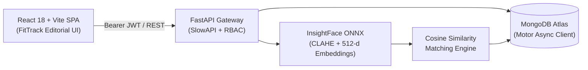

# 🎓 SmartAttend — AI Biometric Attendance System

[](https://www.python.org/)
[](https://fastapi.tiangolo.com/)
[](https://react.dev/)
[](https://www.typescriptlang.org/)
[](https://vitejs.dev/)
[](https://www.mongodb.com/)
[](https://github.com/deepinsight/insightface)
[](#testing)
[](LICENSE)

High-throughput, privacy-focused facial recognition attendance system featuring local neural inference with **InsightFace ONNX**, async persistence with **MongoDB Atlas (Motor)**, role-based access control (**per-user JWT + salted scrypt**), and a **React 18 + Vite** dashboard inspired by the **FitTrack** editorial design system.

---

## ⚡ Demo Credentials

| Role | Username | Password | Access Level |
|---|---|---|---|
| **Administrator** | `admin` | `admin123` | Full access: Enrollment, Directory, Analytics, User Management, Diagnostics, CSV Export |
| **Operator** | `operator` | `operator123` | Operational access: Live Camera Attendance, Instant Scanning, Session Lifecycle |

*1-click preset buttons are available directly on the login screen.*

---

## ✨ Features

- **Multi-Face Recognition**: Identify and mark entire groups simultaneously in under 500ms.
- **Biometric Quality Gate**: Automatic filtering on photo blur, pose angle, eye distance, and edge margin before vector storage.
- **Compensating Rollback**: Automatically reverts biometric embeddings if database persistence fails.
- **Double-Mark Prevention**: Compound unique indexes `(person_id, session_id)` guarantee idempotency.
- **FitTrack-Inspired UI**:
  - Editorial typography (`Playfair Display` serif + `Inter` sans-serif).
  - Organic 60-30-10 palette (Warm Parchment, Deep Ink, Emerald Accent, Golden Hour).
  - Collapsible navigation (68px compact icon rail expanding to 280px on hover with pin lock).
  - Split-panel login screen with preset autofill.
  - Native Dark / Light mode toggle.
- **Analytics & Heatmaps**: 7/30/90-day attendance trends, headcount distributions, 14-day heatmap matrices, and defaulter tracking (<75%).

---

## 🛠️ Tech Stack

| Component | Technology | Purpose |
|---|---|---|
| **Backend** | FastAPI 0.115+ (Python 3.11+) | Async REST API & authentication |
| **Vision Model** | InsightFace (`buffalo_sc`) + ONNX Runtime | Local CPU/GPU face detection & 512-d embeddings |
| **Image Pipeline** | OpenCV (CLAHE) + Pillow | Lighting equalization & safety validation (6000px max) |
| **Database** | MongoDB Atlas via Motor | Non-blocking async document store |
| **Security** | PyJWT + `hashlib.scrypt` + SlowAPI | Signed JWTs, salted password hashing, rate limiting |
| **Frontend** | React 18 + Vite 5 + TypeScript 5 | Client-side SPA with route protection & code splitting |
| **Styling** | Tailwind CSS + shadcn/ui | Editorial design, layered shadows & accessible primitives |
| **State & Motion** | TanStack Query v5 + GSAP | Server-state caching & micro-interactions |

---

## 🏗️ Architecture



---

## 🚀 Quick Start

### 1. Prerequisites
- **Python 3.11+**
- **Node.js 18+** & `npm`
- **MongoDB Atlas** cluster (or local MongoDB v6.0+)

### 2. Backend Setup
```bash
cd backend
python -m venv venv

# Activate virtual environment
# Windows:
venv\Scripts\Activate.ps1
# Linux/macOS:
source venv/bin/activate

pip install -r requirements.txt
cp .env.example .env
# Set MONGODB_URL and JWT_SECRET in backend/.env
```

Create initial admin & operator accounts:
```bash
python scripts/create_user.py --username admin --password "admin123" --role admin
python scripts/create_user.py --username operator --password "operator123" --role operator
```

Start backend server:
```bash
uvicorn main:app --reload --port 8000
```
- API Docs: [http://localhost:8000/docs](http://localhost:8000/docs)

### 3. Frontend Setup
```bash
cd ../frontend
npm install
cp .env.example .env
# Verify VITE_API_URL=http://localhost:8000
npm run dev
```
- Web Application: [http://localhost:5173](http://localhost:5173)

---

## 📡 API Overview

All protected routes accept `Authorization: Bearer <JWT>` or `X-API-Key: <key>`.

| Method | Endpoint | Role | Description |
|---|---|---|---|
| `POST` | `/api/auth/token` | Public | Authenticate user & issue signed JWT |
| `GET` | `/api/auth/me` | Operator | Fetch current authenticated profile |
| `POST` | `/api/auth/register` | Admin | Provision new user credentials |
| `GET` | `/api/persons` | Admin | List all active enrolled individuals |
| `POST` | `/api/persons/enroll` | Admin | Multi-image biometric enrollment with rollback |
| `POST` | `/api/persons/enroll/analyze` | Admin | Pre-enrollment image quality check |
| `DELETE`| `/api/persons/{id}` | Admin | Soft-delete person record |
| `GET` | `/api/sessions` | Operator | List attendance sessions (`?active=true`) |
| `POST` | `/api/sessions` | Operator | Create a new attendance session |
| `PATCH`| `/api/sessions/{id}/end` | Operator | Conclude an active session |
| `POST` | `/api/attendance/identify` | Operator | Detect & identify faces with bounding boxes |
| `POST` | `/api/attendance/mark/{session_id}` | Operator | Identify and idempotently record attendance |
| `GET` | `/api/attendance` | Operator | Query attendance records with multi-filters |
| `GET` | `/api/attendance/export/csv` | Admin | Download attendance data as CSV |
| `GET` | `/api/dashboard/metrics` | Operator | KPI summary cards (enrolled, sessions, rates) |
| `GET` | `/api/reports/daily` | Admin | Attendance trend curves over `?days=N` |
| `GET` | `/api/reports/heatmap` | Admin | 14-day individual presence matrix |

---

## ⚙️ Environment Configuration

### Backend (`backend/.env`)
```ini
JWT_SECRET=your-random-32-character-secret-key
JWT_EXPIRY_HOURS=12
MONGODB_URL=mongodb+srv://<user>:<password>@cluster.mongodb.net/?retryWrites=true&w=majority
MONGODB_DB_NAME=attendance_db
MIN_CONFIDENCE=0.40
DUPLICATE_THRESHOLD=0.45
ALLOWED_ORIGINS=http://localhost:5173
```

### Frontend (`frontend/.env`)
```ini
VITE_API_URL=http://localhost:8000
```

---

## 🧪 Testing

```bash
# Backend test suite (63 unit & integration tests)
cd backend
pytest -v

# Frontend test suite & production build
cd ../frontend
npm test
npm run build
```

---

## 🐳 Docker & Production Deployment

### Run with Docker
```bash
docker build -t smart-attend-backend ./backend
docker run -d -p 8000:8000 --env-file ./backend/.env smart-attend-backend
```

### Cloud Platforms
- **Backend (Render / Railway / Azure App Service)**: Deploy using `backend/Dockerfile` with `/health` check path.
- **Frontend (Vercel / Netlify)**: Deploy `frontend/` directory with build command `npm run build` and output directory `dist`.

---

## 📄 License

Licensed under the [MIT License](LICENSE).
