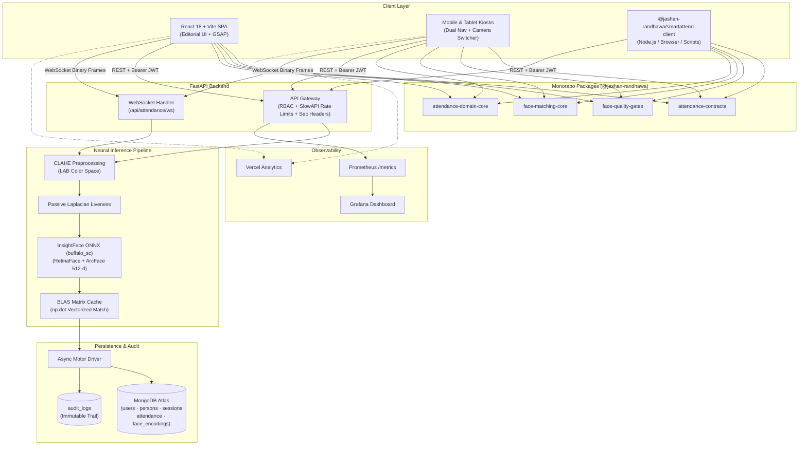

# 🎓 SmartAttend — AI Biometric Attendance System

[](https://www.python.org/)
[](https://fastapi.tiangolo.com/)
[](https://react.dev/)
[](https://www.typescriptlang.org/)
[](https://www.mongodb.com/)
[](LICENSE)
[](https://ai-attendance-system-mauve.vercel.app)

**SmartAttend** is a high-throughput, privacy-first facial recognition attendance platform. It runs **local neural inference** with InsightFace ONNX — no cloud AI APIs, no facial data leaves your infrastructure. The system features vectorized BLAS candidate search, real-time WebSocket video streaming, an editorial React dashboard, role-based access control, immutable audit logging, and a suite of reusable open-source packages.

<p align="center">
  <a href="https://ai-attendance-system-mauve.vercel.app"><strong>🌐 Live Demo</strong></a> · 
  <a href="https://github.com/Jashan-randhawa/AI-Attendance-System/wiki"><strong>📖 Wiki</strong></a> · 
  <a href="#-api-reference"><strong>📡 API Docs</strong></a> · 
  <a href="SECURITY.md"><strong>🔒 Security</strong></a>
</p>

---

## 📑 Table of Contents

- [Demo Credentials](#-demo-credentials)
- [Key Features](#-key-features)
- [System Architecture](#-system-architecture)
- [Tech Stack](#-tech-stack)
- [Monorepo Packages](#-monorepo-packages)
- [Quick Start](#-quick-start)
- [API Reference](#-api-reference)
- [Testing](#-testing)
- [CI / CD Pipelines](#-ci--cd-pipelines)
- [Docker & Deployment](#-docker--deployment)
- [Security & Privacy](#-security--biometric-data-privacy)
- [Project Structure](#-project-structure)
- [Contributing](#-contributing)
- [License](#-license)

---

## ⚡ Demo Credentials

| Role | Username | Password | Access Level |
|:---:|:---:|:---:|:---|
| **Admin** | `admin` | `admin123` | Full access — enrollment, people directory, analytics, heatmaps, user management, CSV export |
| **Operator** | `operator` | `operator123` | Operational access — live camera, attendance scanning, session management, record lookups |

> **Tip:** 1-click preset buttons are available on the login screen. Default credentials are auto-seeded on first startup.

---

## ✨ Key Features

### 🧠 AI & Biometrics
- **Local Neural Inference** — InsightFace ONNX (`buffalo_sc` — RetinaFace detection + ArcFace 512-d embeddings) running entirely on-device with CPU/GPU support. Zero cloud API calls.
- **Vectorized BLAS Candidate Search** — Pre-normalized in-memory embedding matrix with `np.dot(norm_matrix, unknown_emb)` achieving ~50× faster candidate matching than scalar Python loops.
- **Passive Anti-Spoofing** — Laplacian variance analysis on face crops to detect low-resolution photo prints and blurred mobile screens.
- **Biometric Quality Gates** — Automated filtering on blur, bounding box dimensions (≥60 px), 5% border margin clearance, detection confidence (≥0.60), and inter-pupil distance pose validation.
- **CLAHE Image Preprocessing** — Contrast-Limited Adaptive Histogram Equalization in LAB color space for robust performance under varying lighting conditions.
- **Duplicate Enrollment Prevention** — Cross-checks candidate photos against the entire enrolled gallery before persisting, with configurable similarity threshold.

### 🔐 Security & Access Control
- **Per-User JWT Authentication** — Signed HS256 Bearer tokens with configurable expiry, issued per-user with role claims.
- **Salted scrypt Password Hashing** — `hashlib.scrypt` (N=16384, r=8, p=1) with 128-bit random salts; bcrypt backward compatibility.
- **Role-Based Access Control (RBAC)** — Admin vs. Operator role separation enforced at the route dependency level.
- **Per-IP Rate Limiting** — SlowAPI rate limits (20 req/min) on expensive face-recognition endpoints.
- **CORS Startup Guard** — Hard-fails at boot if `ALLOWED_ORIGINS` resolves to `*` with `allow_credentials=True`.
- **Security Response Headers** — `X-Content-Type-Options: nosniff`, `X-Frame-Options: DENY`, `X-XSS-Protection`, `Referrer-Policy`.
- **Biometric Privacy by Design** — 512-d unit-normalized float vectors are mathematically non-reversible. Camera frames processed in volatile RAM only — zero persistent raw photo retention.

### 📡 Real-Time & Streaming
- **WebSocket Live Video** — Bi-directional binary JPEG/WebP or base64 frame streaming over `/api/attendance/ws/{session_id}`, reducing frame latency from ~500 ms to **<120 ms**.
- **Engine-Level Idempotency** — Compound unique indexes `(person_id, session_id)` paired with domain cooldown classification guarantee zero double-marking.
- **Compensating Transaction Rollback** — Automatically reverts database records and prevents orphaned facial vectors on downstream persistence failures.

### 🎨 Frontend & UX
- **Editorial UI Design** — FitTrack-inspired typography (`Playfair Display` + `Inter`), organic 60-30-10 palette (Warm Parchment, Deep Ink, Emerald Accent, Golden Hour).
- **Dark / Light Mode** — Persistent theme toggle with smooth transitions.
- **Responsive Dual Navigation**:
  - *Desktop*: 68 px compact icon rail → 280 px hover expand with pin lock.
  - *Mobile*: Sticky top bar + drawer menu + fixed bottom tab bar with iOS safe area (`pb-safe`).
- **Mobile Camera Controls** — Front/rear lens switcher, mirror preview, flash control, and vertical recognition cards.
- **Fullscreen & Kiosk Mode** — HTML5 Fullscreen API for dedicated attendance tablets.
- **Micro-Interactions** — GSAP-powered tactile depress feedback, animated laser scan overlay, contextSafe match flashes.

### 📊 Observability
- **Prometheus Metrics** — `/metrics` endpoint with histograms for face inference latency (p50/p95/p99), counters for marks (new/duplicate/rejected), and gauges for enrolled subjects.
- **Grafana Dashboard** — Ready-to-import template in `deploy/grafana/dashboard.json`.
- **Immutable Audit Trail** — Dedicated `audit_logs` MongoDB collection capturing every attendance mark, enrollment, and session event with timestamps, actor IDs, and IP addresses.
- **Request-ID Correlation** — Middleware-injected correlation IDs across all structured log lines.
- **Vercel Web Analytics** — RUM tracking Core Web Vitals via `@vercel/analytics` and `@vercel/speed-insights`.

---

## 🏗️ System Architecture


```mermaid
flowchart TD
    subgraph Client["Client Layer"]
        Web["React 18 + Vite SPA<br/>(Editorial UI + GSAP)"]
        Mobile["Mobile & Tablet Kiosks<br/>(Dual Nav + Camera Switcher)"]
        SDK["@jashan-randhawa/smartattend-client<br/>(Node.js / Browser / Scripts)"]
    end

    subgraph Packages["Monorepo Packages (@jashan-randhawa)"]
        Contracts["attendance-contracts"]
        MatchingCore["face-matching-core"]
        QualityCore["face-quality-gates"]
        DomainCore["attendance-domain-core"]
    end

    Web & Mobile & SDK --> Contracts & QualityCore & MatchingCore & DomainCore

    Web & Mobile -- "REST + Bearer JWT" --> Gateway
    Web & Mobile -- "WebSocket Binary Frames" --> WS
    SDK -- "REST + Bearer JWT" --> Gateway

    subgraph Backend["FastAPI Backend"]
        Gateway["API Gateway<br/>(RBAC + SlowAPI Rate Limits + Sec Headers)"]
        WS["WebSocket Handler<br/>(/api/attendance/ws)"]
    end

    subgraph Inference["Neural Inference Pipeline"]
        CLAHE["CLAHE Preprocessing<br/>(LAB Color Space)"]
        Liveness["Passive Laplacian Liveness"]
        InsightFace["InsightFace ONNX (buffalo_sc)<br/>(RetinaFace + ArcFace 512-d)"]
        BLAS["BLAS Matrix Cache<br/>(np.dot Vectorized Match)"]
    end

    Gateway & WS --> CLAHE --> Liveness --> InsightFace --> BLAS

    subgraph Data["Persistence & Audit"]
        Motor["Async Motor Driver"]
        DB[("MongoDB Atlas<br/>(users · persons · sessions<br/>attendance · face_encodings)")]
        Audit[("audit_logs<br/>(Immutable Trail)")]
    end

    BLAS --> Motor --> DB & Audit

    subgraph Observability
        Prom["Prometheus /metrics"]
        Grafana["Grafana Dashboard"]
        RUM["Vercel Analytics"]
    end

    Gateway --> Prom --> Grafana
    Web & Mobile -.-> RUM
```

---

## 🛠️ Tech Stack

| Layer | Technology | Purpose |
|:---|:---|:---|
| **Backend** | FastAPI 0.115+, Python 3.11+, Uvicorn | Async REST API, WebSocket streams, Pydantic v2 validation |
| **Vision** | InsightFace (`buffalo_sc`), ONNX Runtime | Local CPU/GPU face detection + 512-d ArcFace embeddings |
| **Matching** | NumPy BLAS, OpenCV, Pillow | Vectorized dot-product search, CLAHE preprocessing |
| **Database** | MongoDB Atlas, Motor (async) | Non-blocking document persistence, aggregation pipelines |
| **Auth** | PyJWT (HS256), hashlib.scrypt, SlowAPI | Per-user JWTs, salted hashing, per-IP rate limiting |
| **Frontend** | React 18, Vite 5, TypeScript 5 | SPA with code splitting, route protection, SWC compilation |
| **UI** | Tailwind CSS, Radix UI, shadcn/ui, Lucide | Editorial design system, accessible primitives |
| **Animations** | GSAP, TanStack Query v5 | Micro-interactions, server-state cache |
| **Monitoring** | Prometheus, Grafana | Inference latency histograms, attendance counters |
| **Telemetry** | `@vercel/analytics`, `@vercel/speed-insights` | Real User Monitoring, Core Web Vitals |
| **CI/CD** | GitHub Actions (4 workflows), Changesets | Automated testing, vulnerability scanning, semantic releases |

---

## 📦 Monorepo Packages

This repository uses **npm workspaces** to publish decoupled, provider-neutral packages under the `@jashan-randhawa` scope:

| Package | Lang | Description |
|:---|:---:|:---|
| [`@jashan-randhawa/face-matching-core`](./packages/face-matching-core) | TS | L₂ vector normalization, cosine similarity, threshold classification, top-K matching |
| [`@jashan-randhawa/attendance-contracts`](./packages/attendance-contracts) | TS | Shared domain entity types and API request/response contracts (mirrors FastAPI Pydantic) |
| [`@jashan-randhawa/smartattend-client`](./packages/smartattend-client) | TS | Typed HTTP client SDK with automatic Bearer token injection for Node.js, browsers & mobile |
| [`@jashan-randhawa/face-quality-gates`](./packages/face-quality-gates) | TS | Face image quality rules — pose limits, edge margins, blur thresholds, diagnostics |
| [`@jashan-randhawa/attendance-domain-core`](./packages/attendance-domain-core) | TS | Database-neutral attendance marking idempotency rules and duplicate classification |
| [`smartattend-face-matching`](./packages/python/face-matching-core) | Python | Pure Python + NumPy vector normalization, cosine similarity, and candidate ranking |

> 📖 Full package documentation and API references are available in the [Wiki → Modular Packages](https://github.com/Jashan-randhawa/AI-Attendance-System/wiki/Modular-Packages-and-Monorepo).

---

## 🚀 Quick Start

### Prerequisites

- **Python 3.11+**
- **Node.js 18+** & `npm`
- **MongoDB Atlas** connection string (or local MongoDB 6.0+)

### 1. Clone & Install Packages

```bash
git clone https://github.com/Jashan-randhawa/AI-Attendance-System.git
cd AI-Attendance-System

# Install root workspace dependencies (builds all packages):
npm install

# Verify packages:
npm test
node examples/matching-and-quality-demo.js
node examples/client-sdk-demo.js
```

### 2. Backend Setup

```bash
cd backend
python -m venv venv

# Activate virtual environment:
# Windows PowerShell:
venv\Scripts\Activate.ps1
# macOS / Linux:
source venv/bin/activate

pip install -r requirements.txt
cp .env.example .env
# Edit .env → set MONGODB_URL and JWT_SECRET
```

Start the server (auto-seeds default admin/operator on first run):

```bash
uvicorn main:app --reload --port 8000
```

| Endpoint | URL |
|:---|:---|
| Swagger UI | [http://localhost:8000/docs](http://localhost:8000/docs) |
| ReDoc | [http://localhost:8000/redoc](http://localhost:8000/redoc) |
| Prometheus | [http://localhost:8000/metrics](http://localhost:8000/metrics) |
| Health Check | [http://localhost:8000/health](http://localhost:8000/health) |

### 3. Frontend Setup

```bash
cd ../frontend
npm install
cp .env.example .env
# Verify VITE_API_URL=http://localhost:8000

npm run dev
```

Open 👉 [http://localhost:5173](http://localhost:5173)

---

## 📡 API Reference

All protected routes accept `Authorization: Bearer <JWT>` or legacy `X-API-Key: <key>`.

### Authentication

| Method | Endpoint | Auth | Description |
|:---:|:---|:---:|:---|
| `POST` | `/api/auth/token` | Public | Authenticate credentials & issue signed JWT |
| `GET` | `/api/auth/me` | Operator | Get current authenticated user profile |
| `POST` | `/api/auth/register` | Admin | Provision a new user account |

### People Management

| Method | Endpoint | Auth | Description |
|:---:|:---|:---:|:---|
| `GET` | `/api/persons` | Admin | List enrolled individuals |
| `POST` | `/api/persons/enroll` | Admin | Biometric enrollment with quality gates & rollback |
| `POST` | `/api/persons/enroll/analyze` | Admin | Pre-enrollment image quality diagnostic |
| `DELETE` | `/api/persons/{id}` | Admin | Soft-delete person and purge embeddings |

### Sessions

| Method | Endpoint | Auth | Description |
|:---:|:---|:---:|:---|
| `GET` | `/api/sessions` | Operator | List sessions (`?active=true`) |
| `POST` | `/api/sessions` | Operator | Create new attendance session |
| `PATCH` | `/api/sessions/{id}/end` | Operator | End an active session |

### Attendance

| Method | Endpoint | Auth | Description |
|:---:|:---|:---:|:---|
| `POST` | `/api/attendance/identify` | Operator | Detect & identify faces with bounding boxes |
| `POST` | `/api/attendance/mark/{session_id}` | Operator | Identify and idempotently record attendance |
| `WS` | `/api/attendance/ws/{session_id}` | Operator | Real-time WebSocket video streaming |
| `GET` | `/api/attendance` | Operator | Query records with multi-filters |
| `GET` | `/api/attendance/export/csv` | Admin | Download attendance as CSV |

### Analytics & Observability

| Method | Endpoint | Auth | Description |
|:---:|:---|:---:|:---|
| `GET` | `/api/dashboard/metrics` | Operator | KPI summary cards |
| `GET` | `/api/reports/daily` | Admin | Attendance trends over `?days=N` |
| `GET` | `/api/reports/heatmap` | Admin | 14-day individual presence matrix |
| `GET` | `/metrics` | Public | Prometheus scrape endpoint |
| `GET` | `/health` | Public | Health check probe |

> 📖 Interactive docs with request/response schemas available at `/docs` (Swagger) or `/redoc`.

---

## 🧪 Testing

```bash
# 1. Package unit tests (all npm workspaces):
npm test

# 2. Backend tests (pytest):
cd backend
pip install -r requirements-dev.txt
pytest -v

# 3. Frontend tests (Vitest + React Testing Library):
cd ../frontend
npm test

# 4. Frontend production build verification:
npm run build
```

| Suite | Framework | Coverage |
|:---|:---|:---|
| Packages | Node.js `node:test` | 5 packages, 31+ unit tests |
| Backend | pytest + httpx | 11 test modules, 63+ tests (auth, RBAC, idempotency, rollback, CORS, validation, matching) |
| Frontend | Vitest + RTL | Component tests (scanner overlay, recognition cards) + integration |

---

## 🔄 CI / CD Pipelines

| Workflow | Trigger | Jobs |
|:---|:---|:---|
| [`backend-ci.yml`](.github/workflows/backend-ci.yml) | Push/PR to `backend/` | pip-audit vulnerability scan → syntax/import check → pytest |
| [`frontend-ci.yml`](.github/workflows/frontend-ci.yml) | Push/PR to `frontend/` | npm audit (prod + dev) → ESLint → Vitest → production build |
| [`packages-ci.yml`](.github/workflows/packages-ci.yml) | Push/PR to `packages/` | Typecheck → unit tests → tarball smoke tests |
| [`publish-packages.yml`](.github/workflows/publish-packages.yml) | Release | Publish to GitHub Packages registry |

---

## 🐳 Docker & Deployment

### Docker

```bash
docker build -t smartattend-backend ./backend
docker run -d -p 8000:8000 --env-file ./backend/.env smartattend-backend
```

### Cloud Platforms

| Component | Platform | Notes |
|:---|:---|:---|
| **Backend** | Render / Railway / Azure App Service | Deploy with `backend/Dockerfile`, health probe at `/health` |
| **Frontend** | Vercel / Netlify | Build: `npm run build`, output: `dist/`. Monorepo aliases pre-configured |
| **Grafana** | Any Grafana instance | Import `deploy/grafana/dashboard.json` connected to Prometheus |
| **Packages** | GitHub Packages | Automated via `.github/workflows/publish-packages.yml` |

---

## 🔒 Security & Biometric Data Privacy

> For full vulnerability reporting guidelines, see [SECURITY.md](SECURITY.md).

- **Non-Reversible Embeddings** — Biometric features exist strictly as 512-d mathematical floating-point vectors that cannot reconstruct the original face.
- **Ephemeral RAM Processing** — Live video streams and scan uploads are processed in volatile memory and immediately discarded.
- **Immutable Audit Trail** — Every enrollment, attendance mark, and session event is logged to a dedicated `audit_logs` collection with actor identity, IP address, and timestamp.
- **CORS Hardening** — Startup-time enforcement prevents wildcard origins with credentialed requests.
- **Security Headers** — `X-Content-Type-Options`, `X-Frame-Options`, `X-XSS-Protection`, `Referrer-Policy`.
- **Responsible Disclosure** — Submit private reports via [GitHub Security Advisories](https://github.com/Jashan-randhawa/AI-Attendance-System/security/advisories/new) or email `jashanrandhawa76@gmail.com`.

---

## 🗂️ Project Structure

```
AI-Attendance-System/
├── backend/                          # FastAPI + Motor + InsightFace
│   ├── main.py                       # App factory, middleware, router wiring
│   ├── core/
│   │   ├── azure_face.py             # InsightFace engine, BLAS matching, quality checks
│   │   ├── vision_engine.py          # Protocol-based engine abstraction
│   │   ├── auth.py                   # JWT + scrypt + RBAC dependencies
│   │   ├── audit.py                  # Immutable audit trail logger
│   │   ├── database.py               # Motor client, helpers, indexes
│   │   ├── metrics.py                # Prometheus + fallback metrics
│   │   ├── rate_limit.py             # SlowAPI configuration
│   │   ├── schemas.py                # Pydantic response models
│   │   ├── validation.py             # Upload validation (decode + size cap)
│   │   └── logging_context.py        # Request-ID middleware
│   ├── routers/                      # REST + WebSocket route handlers
│   ├── tests/                        # 11 test modules (pytest)
│   ├── scripts/                      # Admin utilities
│   ├── Dockerfile                    # Production container
│   └── requirements.txt
├── frontend/                         # React 18 + Vite + TypeScript
│   ├── src/
│   │   ├── pages/                    # 11 route pages
│   │   ├── components/               # Layout, sidebar, camera, UI primitives
│   │   ├── auth/                     # AuthContext, ProtectedRoute, RoleGuard
│   │   ├── services/api.ts           # Typed API client
│   │   ├── hooks/                    # Custom hooks (mobile, toast, queries)
│   │   └── theme/                    # ThemeContext (dark/light)
│   └── test/                         # Vitest + React Testing Library
├── packages/                         # npm workspace packages
│   ├── face-matching-core/           # @jashan-randhawa/face-matching-core
│   ├── attendance-contracts/         # @jashan-randhawa/attendance-contracts
│   ├── smartattend-client/           # @jashan-randhawa/smartattend-client
│   ├── face-quality-gates/           # @jashan-randhawa/face-quality-gates
│   ├── attendance-domain-core/       # @jashan-randhawa/attendance-domain-core
│   └── python/face-matching-core/    # smartattend-face-matching (PyPI)
├── docs/                             # Architecture, DR runbook, secret rotation
├── deploy/grafana/                   # Grafana dashboard template
├── examples/                         # SDK usage demos
├── .github/workflows/                # 4 CI/CD pipelines
├── .changeset/                       # Changesets versioning config
├── SECURITY.md                       # Vulnerability reporting & privacy policy
├── Remediation_Plan.md               # Security hardening roadmap
└── LICENSE                           # MIT
```

---

## 🤝 Contributing

Contributions are welcome! To get started:

1. **Fork** the repository
2. **Create** a feature branch: `git checkout -b feature/my-feature`
3. **Install** dependencies: `npm install` (root) + `pip install -r backend/requirements.txt`
4. **Run tests** before committing:
   ```bash
   npm test                   # Package tests
   cd backend && pytest -v    # Backend tests
   cd frontend && npm test    # Frontend tests
   ```
5. **Commit** with [conventional commits](https://www.conventionalcommits.org/): `feat:`, `fix:`, `docs:`, `test:`, `perf:`
6. **Open** a Pull Request — CI will run all 4 pipeline workflows automatically

> Please review [SECURITY.md](SECURITY.md) before working with biometric data or authentication code.

---

## 📄 License

Licensed under the [MIT License](LICENSE).

---

<p align="center">
  Built with ❤️ by <a href="https://github.com/Jashan-randhawa">Jashan Randhawa</a>
</p>
