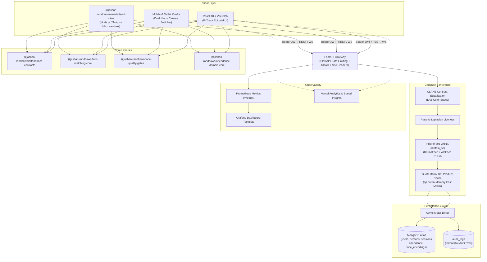

# 🎓 SmartAttend — AI Biometric Attendance System & Modular Monorepo

[](https://www.python.org/)
[](https://fastapi.tiangolo.com/)
[](https://react.dev/)
[](https://www.typescriptlang.org/)
[](https://vitejs.dev/)
[](https://www.mongodb.com/)
[](https://github.com/deepinsight/insightface)
[](https://prometheus.io/)
[](#-testing--verification)
[](https://github.com/Jashan-randhawa/AI-Attendance-System/wiki)
[](https://ai-attendance-system-mauve.vercel.app)
[](LICENSE)

High-throughput, privacy-first facial recognition attendance platform featuring local neural inference with **InsightFace ONNX**, vectorized **BLAS matrix dot-product candidate search**, non-blocking async persistence with **MongoDB Atlas (Motor)**, role-based access control (**per-user JWT + salted scrypt**), an editorial **React 18 + Vite** dashboard with **mobile-responsive dual navigation**, real-time **WebSocket video streaming**, **Prometheus observability**, and a suite of decoupled open-source packages published under the **`@jashan-randhawa`** scope.

> 📖 **Explore the Official Engineering Wiki**: For complete deep dives into neural vision pipelines, mathematical vector normalization, quality heuristics, REST endpoints, and deployment patterns, visit the [SmartAttend Wiki](https://github.com/Jashan-randhawa/AI-Attendance-System/wiki).

---

## ⚡ Demo Credentials

| Role | Username | Password | Access Level |
|---|---|---|---|
| **Administrator** | `admin` | `admin123` | Full access: Biometric enrollment, people directory, analytics & heatmaps, user management, system diagnostics, and CSV export |
| **Operator** | `operator` | `operator123` | Operational access: Live camera surveillance, instant attendance scanning, session lifecycle management, and record lookups |

*1-click preset buttons are available directly on the login screen with automatic initial credential seeding.*

---

## ✨ Key Features

- **Vectorized BLAS Biometric Search**: Normalized in-memory embedding matrix with vectorized NumPy/BLAS dot-product multiplication (`np.dot(norm_matrix, unknown_emb)`) achieving ~50x faster candidate lookups with $O(1)$ amortized memory access.
- **Passive Anti-Spoofing Liveness**: Evaluates Laplacian blur variance on detected face crops to filter out low-resolution physical photo prints and blurred mobile screens.
- **Real-Time WebSocket Video Streaming**: Bi-directional binary JPEG/WebP or base64 frame streaming over `/api/attendance/ws/{session_id}`, cutting frame latency from ~500ms down to **<120ms**.
- **Immutable Audit Logging**: Dedicated MongoDB `audit_logs` collection capturing every attendance mark, person enrollment, and session event with timestamps, actor IDs, and IP addresses.
- **Prometheus Observability & Grafana**: Exposes `/metrics` with standard histograms for face inference latencies (p50/p95/p99), counters for marks (new/duplicate/rejected), and gauges for active enrolled vectors. Includes a ready-to-import Grafana dashboard in `deploy/grafana/dashboard.json`.
- **Biometric Quality Gates**: Automated validation filtering on blur, bounding box dimensions ($\ge 60$px), 5% border margin clearance, and keypoint pupil distance pose angles.
- **Compensating Transaction Rollback**: Automatically reverts database records and prevents orphaned facial vectors upon any downstream persistence failure.
- **Engine-Level Idempotency**: Compound unique indexes `(person_id, session_id)` paired with domain cooldown classification (`IMMEDIATE_RETRY` $\le 15$s) guarantee zero double-marking.
- **Biometric Privacy by Design**: 512-d unit-normalized float vectors are mathematically non-reversible; camera frames are processed in volatile RAM with zero persistent raw photo retention.
- **FitTrack-Inspired Editorial UI**:
  - Editorial typography (`Playfair Display` serif + `Inter` sans-serif).
  - Organic 60-30-10 palette (Warm Parchment, Deep Ink, Emerald Accent, Golden Hour).
  - Emil Kowalski micro-interactions: tactile depress feedback, animated laser scan overlay, and contextSafe match flashes.
  - Native Dark / Light mode toggle with persistent state.
- **Mobile Web Adaptation & Dual Navigation**:
  - **Desktop (`md:` and up)**: 68px compact icon rail expanding to 280px on hover with pin lock and zero-layout-shift spacer rail.
  - **Mobile (`< md`)**: Sticky top bar with quick theme toggle & drawer menu + Fixed bottom tab bar with iOS safe area handling (`pb-safe`).
  - **Mobile Camera Controls**: Front/rear lens switcher (`user` vs `environment`), mirror preview toggle, flash control, and vertically stacked recognition cards.
  - **Window View Modes & Fullscreen**: Fluid fit screen mode (`max-w-none`) and HTML5 Fullscreen API integration for dedicated kiosk tablets.
- **Real User Monitoring (RUM)**: Built-in Vercel Web Analytics & Speed Insights tracking Core Web Vitals.
- **Automated Monorepo Versioning**: Configured with Changesets (`.changeset/config.json`) for automated semantic package releases.

---

## 📦 Modular Monorepo Packages

This monorepo uses **npm workspaces** to publish decoupled, provider-neutral open-source packages extracted from SmartAttend:

| Package | Language | Registry | Description | Documentation |
| :--- | :---: | :---: | :--- | :--- |
| **[`@jashan-randhawa/face-matching-core`](./packages/face-matching-core)** | TypeScript | npm | Vector $L_2$ normalization, cosine similarity engine, threshold classification, and top-K candidate matching | [README](./packages/face-matching-core/README.md) · [Wiki](https://github.com/Jashan-randhawa/AI-Attendance-System/wiki/Modular-Packages-and-Monorepo#31-jashan-randhawaface-matching-core) |
| **[`@jashan-randhawa/attendance-contracts`](./packages/attendance-contracts)** | TypeScript | npm | Shared domain entity types and API request/response contracts matching FastAPI Pydantic models | [README](./packages/attendance-contracts/README.md) · [Wiki](https://github.com/Jashan-randhawa/AI-Attendance-System/wiki/Modular-Packages-and-Monorepo#32-jashan-randhawaattendance-contracts) |
| **[`@jashan-randhawa/smartattend-client`](./packages/smartattend-client)** | TypeScript | npm | Production-ready typed HTTP client SDK with automatic Bearer token injection for Node.js, browsers & mobile | [README](./packages/smartattend-client/README.md) · [Wiki](https://github.com/Jashan-randhawa/AI-Attendance-System/wiki/Modular-Packages-and-Monorepo#33-jashan-randhawasmartattend-client) |
| **[`@jashan-randhawa/face-quality-gates`](./packages/face-quality-gates)** | TypeScript | npm | Biometric face image quality rules, pose angle limits, edge margins, and diagnostics | [README](./packages/face-quality-gates/README.md) · [Wiki](https://github.com/Jashan-randhawa/AI-Attendance-System/wiki/Modular-Packages-and-Monorepo#34-jashan-randhawaface-quality-gates) |
| **[`@jashan-randhawa/attendance-domain-core`](./packages/attendance-domain-core)** | TypeScript | npm | Database-neutral attendance marking idempotency rules and duplicate classification | [README](./packages/attendance-domain-core/README.md) · [Wiki](https://github.com/Jashan-randhawa/AI-Attendance-System/wiki/Modular-Packages-and-Monorepo#35-jashan-randhawaattendance-domain-core) |
| **[`smartattend-face-matching`](./packages/python/face-matching-core)** | Python | PyPI | Pure Python & NumPy vector normalization, cosine similarity, and candidate ranking | [README](./packages/python/face-matching-core/README.md) · [Wiki](https://github.com/Jashan-randhawa/AI-Attendance-System/wiki/Modular-Packages-and-Monorepo#36-smartattend-face-matching-python) |

---

## 🏗️ System Architecture


```mermaid
flowchart TD
    subgraph Client Layer
        Web["React 18 + Vite SPA\n(FitTrack Editorial UI)"]
        Mobile["Mobile & Tablet Kiosks\n(Dual Nav + Camera Switcher)"]
        SDK["@jashan-randhawa/smartattend-client\n(Node.js / Scripts / Microservices)"]
    end

    subgraph Core Libraries
        Contracts["@jashan-randhawa/attendance-contracts"]
        MatchingCore["@jashan-randhawa/face-matching-core"]
        QualityCore["@jashan-randhawa/face-quality-gates"]
        DomainCore["@jashan-randhawa/attendance-domain-core"]
    end

    Web & Mobile & SDK --> Contracts
    Web & Mobile & SDK --> QualityCore
    Web & Mobile & SDK --> MatchingCore
    Web & Mobile & SDK --> DomainCore

    Web & Mobile & SDK -- "Bearer JWT / REST / WS" --> Gateway["FastAPI Gateway\n(SlowAPI Rate Limiting + RBAC + Sec Headers)"]

    subgraph Compute & Inference
        CLAHE["CLAHE Contrast Equalization\n(LAB Color Space)"]
        Liveness["Passive Laplacian Liveness"]
        InsightFace["InsightFace ONNX (buffalo_sc)\n(RetinaFace + ArcFace 512-d)"]
        BLAS["BLAS Matrix Dot-Product Cache\n(np.dot In-Memory Fast Match)"]
    end

    Gateway --> CLAHE --> Liveness --> InsightFace --> BLAS

    subgraph Persistence & Audit
        Motor["Async Motor Driver"]
        DB[("MongoDB Atlas\n(users, persons, sessions,\nattendance, face_encodings)")]
        Audit[("audit_logs\n(Immutable Audit Trail)")]
    end

    BLAS --> Motor --> DB
    BLAS --> Motor --> Audit

    subgraph Observability
        Prom["Prometheus Metrics (/metrics)"]
        Grafana["Grafana Dashboard Template"]
        Vercel["Vercel Analytics & Speed Insights"]
    end

    Gateway --> Prom --> Grafana
    Web & Mobile -.-> Vercel
```

---

## 🛠️ Tech Stack

| Component | Technology | Purpose |
|---|---|---|
| **Backend Framework** | FastAPI 0.115+ (Python 3.11+) | Async REST API, WebSocket streams, Pydantic validation |
| **Vision Inference** | InsightFace (`buffalo_sc`) + ONNX Runtime | Local CPU/GPU face detection and 512-d feature vector extraction |
| **Matrix Accelerator** | NumPy BLAS Vector Operations | Vectorized in-memory dot product candidate search (~50x speedup) |
| **Image Preprocessing** | OpenCV (CLAHE) + Pillow | Lighting equalization, channel split, and safety dimension validation |
| **Database** | MongoDB Atlas via Motor | Non-blocking asynchronous document persistence |
| **Security & Auth** | PyJWT + `hashlib.scrypt` + SlowAPI | Signed Bearer JWTs, salted password hashing, security response headers |
| **Frontend Framework** | React 18 + Vite 5 + TypeScript 5 | Single-page application with code splitting and route protection |
| **UI & Styling** | Tailwind CSS + Lucide Icons | Editorial layout, responsive dual navigation, and layered shadows |
| **State & Animations** | TanStack Query v5 + GSAP | Server-state caching and Emil Kowalski micro-interactions |
| **Observability** | Prometheus Client + Grafana | Real-time inference latency histograms, marks counter, enrolled gauge |
| **Telemetry** | `@vercel/analytics` + `@vercel/speed-insights` | Real User Monitoring (RUM) and Core Web Vitals tracking |
| **Monorepo Ecosystem** | npm workspaces + Changesets | Decoupled libraries with continuous integration and automated versioning |

---

## 🚀 Quick Start

### 1. Prerequisites
- **Python 3.11+**
- **Node.js 18+** & `npm`
- **MongoDB Atlas** connection string (or local MongoDB v6.0+)

### 2. Monorepo Installation & Package Verification
```bash
git clone https://github.com/Jashan-randhawa/AI-Attendance-System.git
cd AI-Attendance-System

# Install root npm workspace dependencies:
npm install

# Run unit tests across all modular packages:
npm test

# Run runnable examples:
node examples/matching-and-quality-demo.js
node examples/client-sdk-demo.js
```

### 3. Backend Setup (`backend/`)
```bash
cd backend
python -m venv venv

# Windows PowerShell:
venv\Scripts\Activate.ps1
# Linux / macOS:
source venv/bin/activate

pip install -r requirements.txt
cp .env.example .env
# Configure MONGODB_URL and JWT_SECRET in backend/.env
```

Start the backend server (automatically seeds default admin/operator if empty):
```bash
uvicorn main:app --reload --port 8000
```
- Interactive Swagger UI: [http://localhost:8000/docs](http://localhost:8000/docs)
- Alternative ReDoc: [http://localhost:8000/redoc](http://localhost:8000/redoc)
- Prometheus Metrics: [http://localhost:8000/metrics](http://localhost:8000/metrics)

### 4. Frontend Setup (`frontend/`)
```bash
cd ../frontend
npm install
cp .env.example .env
# Verify VITE_API_URL=http://localhost:8000
npm run dev
```
- Open browser: 👉 [http://localhost:5173](http://localhost:5173)

---

## 📡 API Overview

All protected routes accept `Authorization: Bearer <JWT>` or `X-API-Key: <key>`.

| Method | Endpoint | Role | Description |
|---|---|---|---|
| `POST` | `/api/auth/token` | Public | Authenticate user credentials & issue signed JWT |
| `GET` | `/api/auth/me` | Operator | Fetch current authenticated user profile |
| `POST` | `/api/auth/register` | Admin | Provision new user account |
| `GET` | `/api/persons` | Admin | List active enrolled individuals |
| `POST` | `/api/persons/enroll` | Admin | Biometric enrollment with quality gate & compensating rollback |
| `POST` | `/api/persons/enroll/analyze` | Admin | Pre-enrollment image quality diagnostic |
| `DELETE`| `/api/persons/{id}` | Admin | Soft-delete person record |
| `GET` | `/api/sessions` | Operator | List attendance sessions (`?active=true`) |
| `POST` | `/api/sessions` | Operator | Create a new attendance session |
| `PATCH`| `/api/sessions/{id}/end` | Operator | Conclude an active session |
| `POST` | `/api/attendance/identify` | Operator | Detect & identify faces with bounding boxes |
| `POST` | `/api/attendance/mark/{session_id}` | Operator | Identify and idempotently record attendance |
| `WS` | `/api/attendance/ws/{session_id}` | Operator | Low-latency live video WebSocket attendance streaming |
| `GET` | `/api/attendance` | Operator | Query attendance records with multi-filters |
| `GET` | `/api/attendance/export/csv` | Admin | Download attendance data as CSV |
| `GET` | `/api/dashboard/metrics` | Operator | KPI summary cards (enrolled, sessions, rates) |
| `GET` | `/api/reports/daily` | Admin | Attendance trend curves over `?days=N` |
| `GET` | `/api/reports/heatmap` | Admin | 14-day individual presence matrix |
| `GET` | `/metrics` | Public | Prometheus observability metrics scrape endpoint |
| `GET` | `/health` | Public | Healthcheck probe endpoint |

---

## 🧪 Testing & Verification

```bash
# 1. Run all npm workspace package test suites (31 unit tests):
npm test

# 2. Run backend test suite (63 unit & integration tests):
cd backend
pytest -v

# 3. Run frontend test suite (Vitest + React Testing Library) & build:
cd ../frontend
npm test
npm run build
```

---

## 🐳 Docker & Production Deployment

### Run with Docker
```bash
docker build -t smart-attend-backend ./backend
docker run -d -p 8000:8000 --env-file ./backend/.env smart-attend-backend
```

### Cloud Platforms
- **Backend (Render / Railway / Azure App Service)**: Deploy using `backend/Dockerfile` with `/health` probe path.
- **Frontend (Vercel / Netlify)**: Deploy `frontend/` directory with build command `npm run build` and output directory `dist`. Includes zero-dependency monorepo aliases.
- **Grafana Dashboard**: Import `deploy/grafana/dashboard.json` into your Grafana instance connected to Prometheus.
- **Packages (GitHub Packages Registry)**: Automated deployment on release via `.github/workflows/publish-packages.yml`.

---

## 🔒 Security & Biometric Data Privacy

Please review our [SECURITY.md](SECURITY.md) for vulnerability reporting guidelines and biometric privacy principles:
- **Non-Reversible Embeddings**: Biometric features exist strictly as 512-d mathematical floating-point vectors that cannot reconstruct the original human likeness.
- **Ephemeral RAM Processing**: Live video streams and scan uploads are processed strictly in volatile memory and immediately discarded.
- **Strict HTTP Headers**: Built-in security response headers (`X-Content-Type-Options: nosniff`, `X-Frame-Options: DENY`, `Referrer-Policy: strict-origin-when-cross-origin`).
- **Responsible Disclosure**: Private vulnerability reports can be submitted via [GitHub Security Advisories](https://github.com/Jashan-randhawa/AI-Attendance-System/security/advisories/new).

---

## 📄 License

Licensed under the [MIT License](LICENSE).
