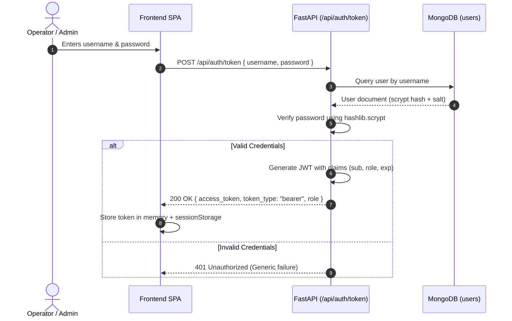

# 🔐 Authentication, Authorization & RBAC

SmartAttend implements a zero-trust, stateless authentication model utilizing signed **JSON Web Tokens (JWT)** and per-user identity tracking.

---

## 1. Authentication Lifecycle

---

## 2. Password Hashing Specification

Passwords are never stored in plaintext. SmartAttend uses standard `hashlib.scrypt` key derivation:

- **Algorithm**: `scrypt`
- **Parameters**: `n=16384`, `r=8`, `p=1` (standard OWASP recommendation for interactive logins)
- **Salt**: 16 cryptographically secure random bytes (`os.urandom(16)`)
- **Storage Format**: `scrypt$16384$8$1$<hex_salt>$<hex_derived_key>`

---

## 3. Role-Based Access Control (RBAC) Hierarchy

The system defines two authenticated operational roles:

| Role | Operational Scope | Endpoints Accessible |
|---|---|---|
| **`operator`** | Day-to-day attendance tracking and surveillance | `/api/sessions/*`, `/api/attendance/identify`, `/api/attendance/mark/*`, `/api/attendance` (read), `/api/dashboard/*` |
| **`admin`** | Administrative authority, configuration, user management & biometrics | All `operator` endpoints **+** `/api/persons/*` (enroll/delete), `/api/persons/enroll/analyze`, `/api/reports/*`, `/api/auth/register`, `/api/auth/users`, `/api/attendance/export/csv` |

### Legacy Header Support
For backward-compatibility with external surveillance hardware or scripts, requests may provide `X-API-Key: <key>`. The server matches against `API_KEY_ADMIN` or `API_KEY_OPERATOR`.

---

## 4. Audit Trail & Identity Stamps

Every mutating database record stores identity stamps:
- Attendance records store `marked_by: ObjectId` (the authenticated user ID).
- Person profiles store `enrolled_by: ObjectId`.
- Deleted persons preserve historic attendance records with non-destructive soft deletes (`is_active: false`).
