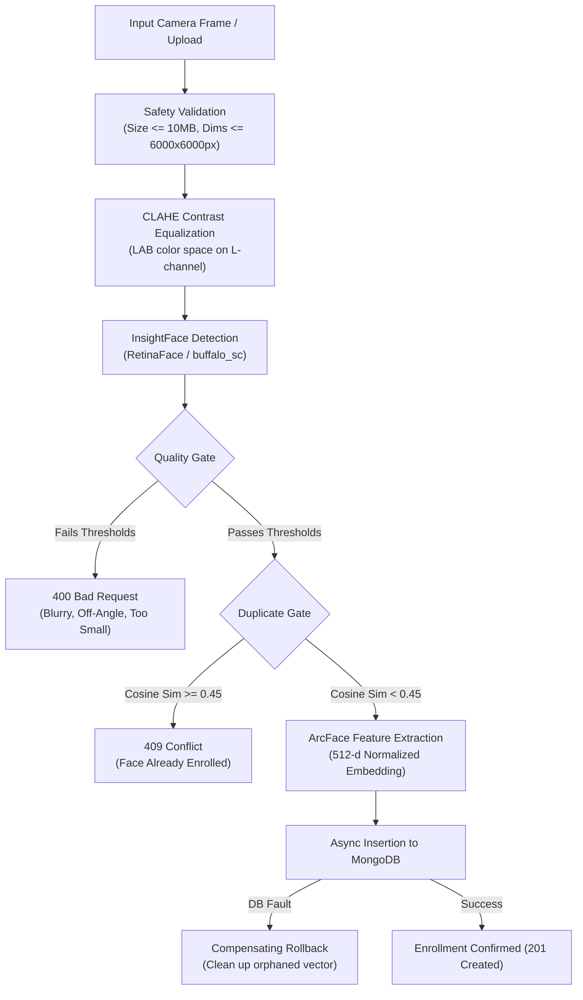

# 👁️ Biometric Vision & Quality Pipeline

SmartAttend leverages local neural networks to identify multiple subjects in unconstrained camera frames without cloud dependencies.

---

## 1. Vision Pipeline Architecture



---

## 2. Face Quality Acceptance Gates

Raw photos submitted to `/api/persons/enroll` or analyzed via `/api/persons/enroll/analyze` must satisfy four mathematical criteria:

1. **Detection Confidence (`det_score >= 0.60`)**:
   - Ensures the bounding region is unambiguously a human face.
2. **Minimum Bounding Box Dimension (`w >= 60px` and `h >= 60px`)**:
   - Rejects distant background faces or low-resolution crops that lack fine feature details.
3. **Edge Margin Clearance (`margin >= 5%`)**:
   - Ensures the subject's face is centered in the frame and not cut off by the camera boundary.
4. **Keypoint Eye Distance Pose Gate (`eye_dist >= 20% face width`)**:
   - Verifies the Euclidean distance between left and right eye landmarks, filtering out profile angles (>45° yaw/pitch) that skew recognition.

---

## 3. Lighting Equalization (CLAHE)

To mitigate shadows, backlighting, and uneven sunlight, incoming frames undergo **Contrast Limited Adaptive Histogram Equalization**:
```python
# Convert to LAB space to separate luminance from color channels
lab = cv2.cvtColor(image, cv2.COLOR_BGR2LAB)
l, a, b = cv2.split(lab)
clahe = cv2.createCLAHE(clipLimit=2.0, tileGridSize=(8, 8))
cl = clahe.apply(l)
enhanced = cv2.merge((cl, a, b))
normalized_bgr = cv2.cvtColor(enhanced, cv2.COLOR_LAB2BGR)
```

---

## 4. Compensating Transaction Rollback

Unlike relational databases with multi-table ACID rollbacks, vector-plus-document persistence spans multiple collections (`face_encodings` and `persons`). 

If metadata insertion fails after the face embedding vector has been indexed, SmartAttend triggers an automated compensating cleanup:
```python
try:
    await db.face_encodings.update_one(...)
    await db.persons.insert_one(person_doc)
except Exception as exc:
    # Compensating rollback: remove vector immediately
    await db.face_encodings.delete_one({"_id": person_id})
    raise HTTPException(status_code=500, detail="Enrollment failed; rolled back.")
```
This guarantees **zero orphaned biometric vectors**.
