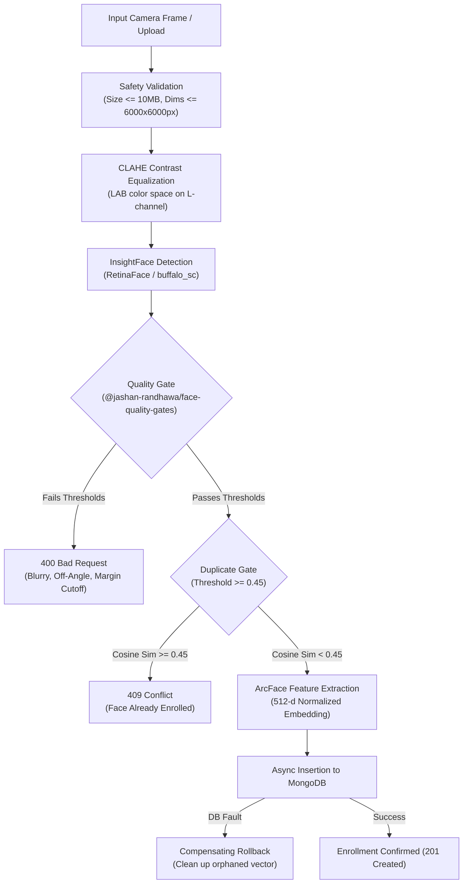

# 👁️ Biometric Vision & Quality Pipeline

SmartAttend leverages local neural networks to identify multiple subjects in unconstrained camera frames without cloud dependencies, backed by strict mathematical quality gates and privacy guarantees.

---

## 1. Vision Pipeline Architecture


```mermaid
flowchart TD
    Frame["Input Camera Frame / Upload"] --> Validate["Safety Validation\n(Size <= 10MB, Dims <= 6000x6000px)"]
    Validate --> CLAHE["CLAHE Contrast Equalization\n(LAB color space on L-channel)"]
    CLAHE --> Detect["InsightFace Detection\n(RetinaFace / buffalo_sc)"]
    Detect --> Filter{"Quality Gate\n(@jashan-randhawa/face-quality-gates)"}

    Filter -- "Fails Thresholds" --> Reject["400 Bad Request\n(Blurry, Off-Angle, Margin Cutoff)"]

    Filter -- "Passes Thresholds" --> DupGate{"Duplicate Gate\n(Threshold >= 0.45)"}
    DupGate -- "Cosine Sim >= 0.45" --> Conflict["409 Conflict\n(Face Already Enrolled)"]

    DupGate -- "Cosine Sim < 0.45" --> ArcFace["ArcFace Feature Extraction\n(512-d Normalized Embedding)"]
    ArcFace --> DBInsert["Async Insertion to MongoDB"]
    DBInsert -- "DB Fault" --> Rollback["Compensating Rollback\n(Clean up orphaned vector)"]
    DBInsert -- "Success" --> Complete["Enrollment Confirmed (201 Created)"]
```

---

## 2. Face Quality Acceptance Gates

Photos submitted to `/api/persons/enroll` or evaluated on client devices via `@jashan-randhawa/face-quality-gates` must satisfy five mathematical criteria:

1. **Detection Confidence (`det_score >= 0.60`)**:
   - Ensures the bounding region is unambiguously a human face.
2. **Minimum Bounding Box Dimension (`w >= 60px` and `h >= 60px`)**:
   - Rejects distant background faces or low-resolution crops lacking fine facial details.
3. **Edge Margin Clearance (`margin >= 5%`)**:
   - Ensures the subject's face is centered in the frame and not truncated by the camera edge.
4. **Keypoint Eye Distance Pose Gate (`eye_dist >= 20% face width`)**:
   - Verifies the Euclidean distance between left and right pupil landmarks, filtering out profile angles (>45° yaw/pitch) that skew recognition.
5. **Single Face Constraint (`maxFacesAllowed: 1`)**:
   - Enrollment requires exactly one distinct face to prevent ambiguous vector association.

---

## 3. Lighting Equalization (CLAHE)

To mitigate shadows, backlighting, and uneven sunlight, incoming frames undergo **Contrast Limited Adaptive Histogram Equalization**:
```python
# Convert to LAB space to separate luminance from color channels
lab = cv2.cvtColor(image, cv2.COLOR_BGR2LAB)
l, a, b = cv2.split(lab)
clahe = cv2.createCLAHE(clipLimit=2.0, tileGridSize=(8, 8))
cl = clahe.apply(l)
enhanced = cv2.merge((cl, a, b))
normalized_bgr = cv2.cvtColor(enhanced, cv2.COLOR_LAB2BGR)
```

---

## 4. Compensating Transaction Rollback

Unlike relational databases with multi-table ACID rollbacks, distributed document stores risk orphaned vectors if an enrollment step fails. SmartAttend implements **compensating rollbacks**:

```python
try:
    person_doc = await db.persons.insert_one(person_data)
    encoding_doc = await db.face_encodings.insert_one({
        "person_id": person_doc.inserted_id,
        "embedding": normalized_vector.tolist(),
        "created_at": datetime.utcnow()
    })
except Exception as e:
    # Compensating transaction to ensure zero orphaned state:
    if "person_doc" in locals() and person_doc.inserted_id:
        await db.persons.delete_one({"_id": person_doc.inserted_id})
    if "encoding_doc" in locals() and encoding_doc.inserted_id:
        await db.face_encodings.delete_one({"_id": encoding_doc.inserted_id})
    raise HTTPException(status_code=500, detail="Enrollment transaction failed; rollback executed.")
```

---

## 5. Biometric Data Privacy & Security

In compliance with GDPR, FERPA, and ethical AI standards, SmartAttend adheres to strict biometric privacy principles:

1. **Non-Reversible Embeddings**:
   - Facial features are stored exclusively as 512-dimensional floating-point mathematical vectors.
   - It is mathematically impossible to reconstruct the original high-resolution human face or photo from a unit-normalized ArcFace embedding vector.
2. **Ephemeral Image Processing**:
   - Surveillance camera frames and scan uploads are processed entirely in volatile memory (RAM) and immediately discarded post-identification. No raw live surveillance video or scan frames are written to persistent disk.
3. **Threshold Calibration**:
   - Cosine similarity thresholds (`0.40` for identification, `0.45` for duplicate prevention) are calibrated for optical sensors with CLAHE pre-filtering.
4. **Isolated Enrollment Records**:
   - Facial vectors are decoupled from personal identity records via separate MongoDB collections (`persons` vs `face_encodings`) linked by foreign `person_id`.
