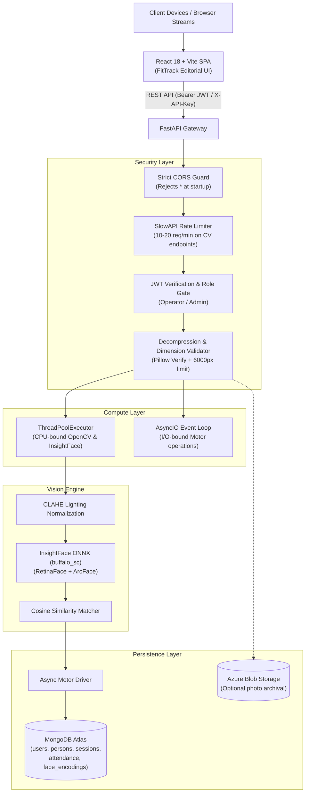

# 🏗️ System Architecture & Compute Engine

SmartAttend is engineered as an asynchronous, decoupled client-server architecture balancing compute-heavy computer vision tasks with high-throughput I/O persistence.

---

## 1. High-Level Architectural Model

---

## 2. Decoupled Compute Architecture

### CPU vs. I/O Separation
- **I/O Non-blocking Execution**: All database queries, user management, and session transactions run natively on the Python `asyncio` event loop using **Motor** (`AsyncIOMotorClient`).
- **CPU-bound Offloading**: Computer vision inference (RetinaFace detection, landmark alignment, ArcFace feature extraction) runs synchronously via a threadpool executor to avoid starving the `asyncio` event loop.

### Scaling & Bottleneck Triggers
Biometric matching is currently performed using in-memory vectorized cosine similarity. The system logs structured performance metrics to monitor:
- **Threshold 1**: Active enrolled individuals > **500 persons**.
- **Threshold 2**: 95th-percentile (`p95`) identification latency > **2.0 seconds**.

#### Scaling Roadmap:
1. **Tier 1 (In-Memory Matrix)**: Cache normalized 512-d embeddings as a contiguous NumPy array, invalidated upon enroll/delete operations.
2. **Tier 2 (Vector Database)**: Migrate matching logic to **MongoDB Atlas Vector Search** (HNSW index) or dedicated vector store (FAISS / Milvus).
