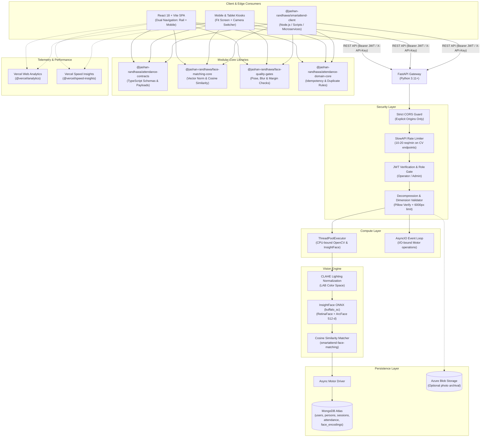

# 🏗️ System Architecture & Compute Engine

SmartAttend is engineered as an asynchronous, decoupled client-server architecture balancing compute-heavy computer vision tasks with high-throughput I/O persistence and a suite of standalone modular packages.

---

## 1. High-Level Architectural Model

```mermaid
flowchart TD
    subgraph Client & Edge Consumers
        Web["React 18 + Vite SPA\n(Dual Navigation: Rail + Mobile)"]
        Mobile["Mobile & Tablet Kiosks\n(Fit Screen + Camera Switcher)"]
        SDK["@jashan-randhawa/smartattend-client\n(Node.js / Scripts / Microservices)"]
    end

    subgraph Modular Core Libraries
        Contracts["@jashan-randhawa/attendance-contracts\n(TypeScript Schemas & Payloads)"]
        MatchingCore["@jashan-randhawa/face-matching-core\n(Vector Norm & Cosine Similarity)"]
        QualityCore["@jashan-randhawa/face-quality-gates\n(Pose, Blur & Margin Checks)"]
        DomainCore["@jashan-randhawa/attendance-domain-core\n(Idempotency & Duplicate Rules)"]
    end

    Web & Mobile & SDK --> Contracts
    Web & Mobile & SDK --> QualityCore
    Web & Mobile & SDK --> MatchingCore
    Web & Mobile & SDK --> DomainCore

    Web & Mobile & SDK -- "REST API (Bearer JWT / X-API-Key)" --> Gateway["FastAPI Gateway\n(Python 3.11+)"]

    subgraph Security Layer
        CORS["Strict CORS Guard\n(Explicit Origins Only)"]
        SlowAPI["SlowAPI Rate Limiter\n(10-20 req/min on CV endpoints)"]
        RBAC["JWT Verification & Role Gate\n(Operator / Admin)"]
        Validation["Decompression & Dimension Validator\n(Pillow Verify + 6000px limit)"]
    end

    Gateway --> CORS --> SlowAPI --> RBAC --> Validation

    subgraph Compute Layer
        ThreadPool["ThreadPoolExecutor\n(CPU-bound OpenCV & InsightFace)"]
        EventLoop["AsyncIO Event Loop\n(I/O-bound Motor operations)"]
    end

    Validation --> ThreadPool
    Validation --> EventLoop

    subgraph Vision Engine
        CLAHE["CLAHE Lighting Normalization\n(LAB Color Space)"]
        InsightFace["InsightFace ONNX (buffalo_sc)\n(RetinaFace + ArcFace 512-d)"]
        Sim["Cosine Similarity Matcher\n(smartattend-face-matching)"]
    end

    ThreadPool --> CLAHE --> InsightFace --> Sim

    subgraph Persistence Layer
        Motor["Async Motor Driver"]
        MongoDB[("MongoDB Atlas\n(users, persons, sessions,\nattendance, face_encodings)")]
        AzureBlob[("Azure Blob Storage\n(Optional photo archival)")]
    end

    Sim --> Motor --> MongoDB
    Validation -.-> AzureBlob

    subgraph Telemetry & Performance
        VercelAnalytics["Vercel Web Analytics\n(@vercel/analytics)"]
        VercelSpeed["Vercel Speed Insights\n(@vercel/speed-insights)"]
    end

    Web & Mobile -.-> VercelAnalytics
    Web & Mobile -.-> VercelSpeed
```

---

## 2. Decoupled Compute Architecture

### CPU vs. I/O Separation
- **I/O Non-blocking Execution**: All database queries, user management, and session transactions run natively on the Python `asyncio` event loop using **Motor** (`AsyncIOMotorClient`).
- **CPU-bound Offloading**: Computer vision inference (RetinaFace detection, landmark alignment, ArcFace feature extraction) runs synchronously via a threadpool executor to avoid starving the `asyncio` event loop.

### Scaling & Bottleneck Triggers
Biometric matching is performed using vectorized cosine similarity. The system logs structured performance metrics to monitor:
- **Threshold 1**: Active enrolled individuals > **500 persons**.
- **Threshold 2**: 95th-percentile (`p95`) identification latency > **2.0 seconds**.
When exceeded, the system is architected to transition from in-memory cosine matching to approximate nearest neighbor (ANN) vector indices (e.g. MongoDB Atlas Vector Search or Milvus / Qdrant).

---

## 3. Modular Monorepo Integration

By decoupling core algorithmic logic into `@jashan-randhawa/*` packages:
1. **Edge Pre-filtering**: Client devices evaluate photo quality locally using `@jashan-randhawa/face-quality-gates` before uploading large image payloads over cellular or low-bandwidth networks.
2. **Deterministic Idempotency**: Domain deduplication rules (`@jashan-randhawa/attendance-domain-core`) are shared across both client-side optimistic UI updates and backend verification.
3. **Cross-Platform Client SDK**: External systems, hardware scanners, and background cron jobs consume `@jashan-randhawa/smartattend-client` for seamless API interaction.
